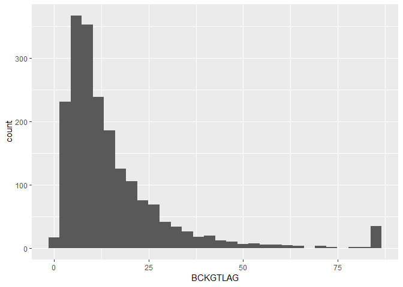

R Notebook: Improving Construct Validity in Studies of Technology
Transfer
================
Malcolm S. Townes
(July 25, 2019)

## Introduction

This is an R Notebook for an investigation that explores possibilities
for improving construct validity in studies of technology transfer.

## Project Set Up

The following code chunk enables the R Notebook to integrate seamlessly
with the project organization format. This is normally included in the R
Notebook to simplify file calls and enable file portability but it has
been causing an error. To work around this problem, I’ve embedded the
`here()` function where I enter a file path when necessary.

``` r
knitr::opts_knit$set(root.dir = here::here())
```

## Load Dependencies

The following code chunk loads package dependencies required to perform
the necessary tasks. Basic tasks include importing, reading, wrangling,
and cleaning data; selecting a subset of the data; checking for unique
observations; analyzing missing data; and performing various types of
regression analyses.

``` r
library(tidyverse) # loads the basic R packages
library(here) # enables file portability
library(readr) # functions for reading data
library(dplyr) # functions for data wrangling
library(janitor) # functions for data cleaning
library(naniar) # functions for analyzing missing data
library(expss) # functions for calculating on values
library(ggplot2) # functions for data visualizations
library(boot) # functions for regression analysis
library(ordinal) # functions for regression models for ordinal data
library(MASS) # functions for ordered logistic or probit regression
library(broom) # functions for tidying ordinal logistic regression models
library(gvlma) # functions for global validation of linear model assumptions
library(lmtest) # functions for testing linear regression models
library(leaps) # functions for regression subset selection
library(car) # companion to applied regression
library(aod) # functions to analyze overdispersed data counts and proportions
library(pscl) # contains function for pseudo R2 measures for logistic regression
library(ResourceSelection) # contains function for Hosmer-Lemeshow goodness of fit test
```

## Load Raw Data

The following code chunk imports the raw data from the `txt` file for
the NBER data set for the period 1963 to
1999.

``` r
DataRaw <- read.table(here("DataRaw","NBERpatents1963to1999/apat63_99.txt"), 
                      sep = ",", header = TRUE, fill = TRUE, dec = ".")
```

## Subset Data

The following code chunk creates a subset of the data for the period
1990 through 1995.

``` r
DataRaw %>% # subset data
  filter(GYEAR>=1990) %>%
  filter(GYEAR<=1995) -> DataSubset90to95
DataSubset90to95 <- as_tibble(DataSubset90to95) # convert data frame to tibble
```

## Extract Sample Data

The following code chunk takes a sample of 2,000 cases from the data
subset for the period 1990 through 1995.

``` r
set.seed(1972)
Sample90to95 <- sample(1:nrow(DataSubset90to95), size = 2000, 
                       replace = TRUE, prob = NULL)
Sample90to95 <- DataSubset90to95[Sample90to95,]
Sample90to95 <- as_tibble(Sample90to95)
```

## Inspect Self-Citation Variables

``` r
print(count_if(gt(0),Sample90to95$SELFCTUB))
```

    ## [1] 566

``` r
print(count_if(gt(0),Sample90to95$SELFCTLB))
```

    ## [1] 566

``` r
print(count_if(gt(0),Sample90to95$SECDUPBD))
```

    ## [1] 467

``` r
print(count_if(gt(0),Sample90to95$SECDLWBD))
```

    ## [1] 467

## Clean Data 01

The following code chunk reorganizes the variables and eliminates
variables not used in the analysis.

``` r
Sample90to95 %>%
  dplyr::select(PATENT, GYEAR, CRECEIVE, CAT, CLAIMS, CMADE, GENERAL, 
                ORIGINAL, FWDAPLAG, BCKGTLAG) -> Sample90to95A 
# Another package also has a `select()` function
```

## Inspect Sample Data

The following code chunk evaluates the data sample to determine if
additional data cleaning is necessary. It first checks for missing data
for each variable. It then checks for missing data for each variable in
each case. Then it checks for duplicate cases with the `PATENT` variable
to determine if that variable can be used as a unique identifier for
each case. Finally, it checks for duplicate cases across all variables
to ensure that each case is unique.

``` r
miss_var_summary(Sample90to95A, order = TRUE)
```

    ## # A tibble: 10 x 3
    ##    variable n_miss pct_miss
    ##    <chr>     <int>    <dbl>
    ##  1 GENERAL     327     16.4
    ##  2 FWDAPLAG    327     16.4
    ##  3 ORIGINAL     48      2.4
    ##  4 BCKGTLAG     34      1.7
    ##  5 PATENT        0      0  
    ##  6 GYEAR         0      0  
    ##  7 CRECEIVE      0      0  
    ##  8 CAT           0      0  
    ##  9 CLAIMS        0      0  
    ## 10 CMADE         0      0

``` r
miss_case_summary(Sample90to95A, order = TRUE)
```

    ## # A tibble: 2,000 x 3
    ##     case n_miss pct_miss
    ##    <int>  <int>    <dbl>
    ##  1   346      4       40
    ##  2   516      4       40
    ##  3   590      4       40
    ##  4  1176      4       40
    ##  5  1224      4       40
    ##  6  1470      4       40
    ##  7  1664      4       40
    ##  8  1792      4       40
    ##  9  1111      3       30
    ## 10  1337      3       30
    ## # ... with 1,990 more rows

``` r
get_dupes(Sample90to95A, PATENT)
```

    ## # A tibble: 4 x 11
    ##   PATENT dupe_count GYEAR CRECEIVE   CAT CLAIMS CMADE GENERAL ORIGINAL
    ##    <int>      <int> <int>    <int> <int>  <int> <int>   <dbl>    <dbl>
    ## 1 4.99e6          2  1991        0     1     15     9      NA    0.370
    ## 2 4.99e6          2  1991        0     1     15     9      NA    0.370
    ## 3 5.30e6          2  1994        0     1      2     6      NA    0.278
    ## 4 5.30e6          2  1994        0     1      2     6      NA    0.278
    ## # ... with 2 more variables: FWDAPLAG <dbl>, BCKGTLAG <dbl>

``` r
get_dupes(Sample90to95A)
```

    ## # A tibble: 4 x 11
    ##   PATENT GYEAR CRECEIVE   CAT CLAIMS CMADE GENERAL ORIGINAL FWDAPLAG
    ##    <int> <int>    <int> <int>  <int> <int>   <dbl>    <dbl>    <dbl>
    ## 1 4.99e6  1991        0     1     15     9      NA    0.370       NA
    ## 2 4.99e6  1991        0     1     15     9      NA    0.370       NA
    ## 3 5.30e6  1994        0     1      2     6      NA    0.278       NA
    ## 4 5.30e6  1994        0     1      2     6      NA    0.278       NA
    ## # ... with 2 more variables: BCKGTLAG <dbl>, dupe_count <int>

## Adjust for Missing Data

The following code chunk modifies cases with missing data, removes
duplicate cases, and then evaluates the data sample to determine if
additional cleaning is necessary. It first assigns a value of `0` to
instances of `NA` in the data for the `GENERAL` variable. It then
assigns a value of `1` to instances of `NA` in the data for the
`ORIGINAL` variable. For the `FWDAPLAG` and `BCKGTLAG` variables it
assigns the maximum value in the data for each variable to instances of
missing data. It then removes duplicate cases. The code chunk then
checks for missing data for each variable in each case and missing data
for each case. Then it checks for duplicate cases with the `PATENT`
variable to determine if that variable can be used as a unique
identifier for each case. Finally, it checks for duplicate observations
across all variables to ensure that each case is unique.

``` r
Sample90to95B <- Sample90to95A
Sample90to95B$GENERAL[is.na(x=Sample90to95B$GENERAL)] <- 0
Sample90to95B$ORIGINAL[is.na(x=Sample90to95B$ORIGINAL)] <- 1
Sample90to95B$FWDAPLAG[is.na(x=Sample90to95B$FWDAPLAG)] <- max(Sample90to95B$FWDAPLAG, na.rm = TRUE)
Sample90to95B$BCKGTLAG[is.na(x=Sample90to95B$BCKGTLAG)] <- max(Sample90to95B$BCKGTLAG, na.rm = TRUE)

Sample90to95B %>%
  distinct() -> Sample90to95B

miss_var_summary(Sample90to95B, order = TRUE)
```

    ## # A tibble: 10 x 3
    ##    variable n_miss pct_miss
    ##    <chr>     <int>    <dbl>
    ##  1 PATENT        0        0
    ##  2 GYEAR         0        0
    ##  3 CRECEIVE      0        0
    ##  4 CAT           0        0
    ##  5 CLAIMS        0        0
    ##  6 CMADE         0        0
    ##  7 GENERAL       0        0
    ##  8 ORIGINAL      0        0
    ##  9 FWDAPLAG      0        0
    ## 10 BCKGTLAG      0        0

``` r
miss_case_summary(Sample90to95B, order = TRUE)
```

    ## # A tibble: 1,998 x 3
    ##     case n_miss pct_miss
    ##    <int>  <int>    <dbl>
    ##  1     1      0        0
    ##  2     2      0        0
    ##  3     3      0        0
    ##  4     4      0        0
    ##  5     5      0        0
    ##  6     6      0        0
    ##  7     7      0        0
    ##  8     8      0        0
    ##  9     9      0        0
    ## 10    10      0        0
    ## # ... with 1,988 more rows

``` r
get_dupes(Sample90to95B, PATENT)
```

    ## # A tibble: 0 x 11
    ## # ... with 11 variables: PATENT <int>, dupe_count <int>, GYEAR <int>,
    ## #   CRECEIVE <int>, CAT <int>, CLAIMS <int>, CMADE <int>, GENERAL <dbl>,
    ## #   ORIGINAL <dbl>, FWDAPLAG <dbl>, BCKGTLAG <dbl>

``` r
get_dupes(Sample90to95B)
```

    ## # A tibble: 0 x 11
    ## # ... with 11 variables: PATENT <int>, GYEAR <int>, CRECEIVE <int>,
    ## #   CAT <int>, CLAIMS <int>, CMADE <int>, GENERAL <dbl>, ORIGINAL <dbl>,
    ## #   FWDAPLAG <dbl>, BCKGTLAG <dbl>, dupe_count <int>

## Calculate Measures of Central Tendency

The following code chunk calculates measures of central tendency in the
sample data for each of the
    variables.

``` r
summary(Sample90to95B)
```

    ##      PATENT            GYEAR         CRECEIVE           CAT       
    ##  Min.   :4890423   Min.   :1990   Min.   : 0.000   Min.   :1.000  
    ##  1st Qu.:5034806   1st Qu.:1991   1st Qu.: 1.000   1st Qu.:2.000  
    ##  Median :5185746   Median :1993   Median : 3.000   Median :4.000  
    ##  Mean   :5184975   Mean   :1993   Mean   : 4.952   Mean   :3.725  
    ##  3rd Qu.:5336132   3rd Qu.:1994   3rd Qu.: 6.000   3rd Qu.:5.000  
    ##  Max.   :5479597   Max.   :1995   Max.   :99.000   Max.   :6.000  
    ##      CLAIMS           CMADE            GENERAL          ORIGINAL     
    ##  Min.   :  1.00   Min.   :  0.000   Min.   :0.0000   Min.   :0.0000  
    ##  1st Qu.:  6.00   1st Qu.:  4.000   1st Qu.:0.0000   1st Qu.:0.0000  
    ##  Median : 10.00   Median :  7.000   Median :0.0907   Median :0.4444  
    ##  Mean   : 12.69   Mean   :  8.398   Mean   :0.2578   Mean   :0.3828  
    ##  3rd Qu.: 17.00   3rd Qu.: 11.000   3rd Qu.:0.5000   3rd Qu.:0.6250  
    ##  Max.   :101.00   Max.   :158.000   Max.   :0.8800   Max.   :1.0000  
    ##     FWDAPLAG         BCKGTLAG    
    ##  Min.   : 0.000   Min.   : 0.00  
    ##  1st Qu.: 3.000   1st Qu.: 6.50  
    ##  Median : 4.000   Median :10.75  
    ##  Mean   : 4.959   Mean   :15.13  
    ##  3rd Qu.: 6.000   3rd Qu.:18.50  
    ##  Max.   :10.500   Max.   :85.14

## Prepare Histograms

The following code chunk displays histograms for the variables to enable
visual inspection of the data to evaluate whether or not they fit normal
distributions. The code chunk generates separate `png` files for each
histogram, which are saved in the `Results` folder.

``` r
ggplot() +
  geom_histogram(Sample90to95B, mapping = aes(GYEAR))
```

<!-- -->

``` r
ggsave(here("results", "histogramGYEAR.png"), dpi = 300)
ggsave(here("results", "histogramGYEAR.jpg"), dpi = 300)

ggplot() +
  geom_histogram(Sample90to95B, mapping = aes(CRECEIVE))
```

<!-- -->

``` r
ggsave(here("Results", "histogramCRECEIVE.png"), dpi = 300)
ggsave(here("Results", "histogramCRECEIVE.jpg"), dpi = 300)

ggplot() +
  geom_histogram(Sample90to95B, mapping = aes(CAT))
```

<!-- -->

``` r
ggsave(here("Results", "histogramCAT.png"), dpi = 300)
ggsave(here("Results", "histogramCAT.jpg"), dpi = 300)

ggplot() +
  geom_histogram(Sample90to95B, mapping = aes(CLAIMS))
```

<!-- -->

``` r
ggsave(here("Results", "histogramCLAIMS.png"), dpi = 300)
ggsave(here("Results", "histogramCLAIMS.jpg"), dpi = 300)

ggplot() +
  geom_histogram(Sample90to95B, mapping = aes(CMADE))
```

<!-- -->

``` r
ggsave(here("Results", "histogramCMADE.png"), dpi = 300)
ggsave(here("Results", "histogramCMADE.jpg"), dpi = 300)

ggplot() +
  geom_histogram(Sample90to95B, mapping = aes(GENERAL))
```

<!-- -->

``` r
ggsave(here("Results", "histogramGENERAL.png"), dpi = 300)
ggsave(here("Results", "histogramGENERAL.jpg"), dpi = 300)

ggplot() +
  geom_histogram(Sample90to95B, mapping = aes(ORIGINAL))
```

<!-- -->

``` r
ggsave(here("Results", "histogramORIGINAL.png"), dpi = 300)
ggsave(here("Results", "histogramORIGINAL.jpg"), dpi = 300)

ggplot() +
  geom_histogram(Sample90to95B, mapping = aes(FWDAPLAG))
```

<!-- -->

``` r
ggsave(here("Results", "histogramFWDAPLAG.png"), dpi = 300)
ggsave(here("Results", "histogramFWDAPLAG.jpg"), dpi = 300)

ggplot() +
  geom_histogram(Sample90to95B, mapping = aes(BCKGTLAG))
```

<!-- -->

``` r
ggsave(here("Results", "histogramBCKGTLAG.png"), dpi = 300)
ggsave(here("Results", "histogramBCKGTLAG.jpg"), dpi = 300)
```

## Prepare Scatter Plots

The following code chunk displays scatter plots with `CRECEIVE` as the
dependent variable against each of the the independent variables to
visually inspect for linear relationships between the dependent variable
and each of the independent variables. The code chunk generates separate
`png` files for each scatter plot, which are saved in the `Results`
folder.

``` r
ggplot() +
  geom_point(Sample90to95B, mapping = aes(x = GYEAR, y = CRECEIVE))
```

<!-- -->

``` r
ggsave(here("results", "scatterCRECEIVEbyGYEAR.png"), dpi = 300)
ggsave(here("results", "scatterCRECEIVEbyGYEAR.jpg"), dpi = 300)

ggplot() +
  geom_point(Sample90to95B, mapping = aes(x = CAT, y = CRECEIVE))
```

<!-- -->

``` r
ggsave(here("results", "scatterCRECEIVEbyCAT.png"), dpi = 300)
ggsave(here("results", "scatterCRECEIVEbyCAT.jpg"), dpi = 300)

ggplot() +
  geom_point(Sample90to95B, mapping = aes(x = CLAIMS, y = CRECEIVE))
```

<!-- -->

``` r
ggsave(here("results", "scatterCRECEIVEbyCLAIMS.png"), dpi = 300)
ggsave(here("results", "scatterCRECEIVEbyCLAIMS.jpg"), dpi = 300)

ggplot() +
  geom_point(Sample90to95B, mapping = aes(x = CMADE, y = CRECEIVE))
```

<!-- -->

``` r
ggsave(here("results", "scatterCRECEIVEbyCMADE.png"), dpi = 300)
ggsave(here("results", "scatterCRECEIVEbyCMADE.jpg"), dpi = 300)

ggplot() +
  geom_point(Sample90to95B, mapping = aes(x = GENERAL, y = CRECEIVE))
```

<!-- -->

``` r
ggsave(here("results", "scatterCRECEIVEbyGENERAL.png"), dpi = 300)
ggsave(here("results", "scatterCRECEIVEbyGENERAL.jpg"), dpi = 300)

ggplot() +
  geom_point(Sample90to95B, mapping = aes(x = ORIGINAL, y = CRECEIVE))
```

<!-- -->

``` r
ggsave(here("results", "scatterCRECEIVEbyORIGINAL.jpg"), dpi = 300)
ggsave(here("results", "scatterCRECEIVEbyORIGINAL.jpg"), dpi = 300)

ggplot() +
  geom_point(Sample90to95B, mapping = aes(x = FWDAPLAG, y = CRECEIVE))
```

<!-- -->

``` r
ggsave(here("results", "scatterCRECEIVEbyFWDAPLAG.png"), dpi = 300)
ggsave(here("results", "scatterCRECEIVEbyFWDAPLAG.jpg"), dpi = 300)

ggplot() +
  geom_point(Sample90to95B, mapping = aes(x = BCKGTLAG, y = CRECEIVE))
```

<!-- -->

``` r
ggsave(here("results", "scatterCRECEIVEbyBCKGTLAG.png"), dpi = 300)
ggsave(here("results", "scatterCRECEIVEbyBCKGTLAG.jpg"), dpi = 300)
```

## Prepare Q-Q Plots

The following code chunk displays Quantile-Quantile (Q-Q) plots to check
for normal distribution in the data sample for each variable. The code
chunk generates separate `png` files for each Q-Q plot, which are saved
in the `Results` folder.

``` r
ggplot(Sample90to95B)+
  aes(sample = GYEAR)+
  stat_qq()+
  stat_qq_line()+
  ggtitle("GYEAR Q-Q Plot")
```

<!-- -->

``` r
ggsave(here("Results", "QQplotGYEAR.png"))
ggsave(here("Results", "QQplotGYEAR.jpg"))

ggplot(Sample90to95B)+
  aes(sample = CRECEIVE)+
  stat_qq()+
  stat_qq_line()+
  ggtitle("CRECEIVE Q-Q Plot")
```

<!-- -->

``` r
ggsave(here("Results", "QQplotCRECEIVE.png"))
ggsave(here("Results", "QQplotCRECEIVE.jpg"))

ggplot(Sample90to95B)+
  aes(sample = CLAIMS)+
  stat_qq()+
  stat_qq_line()+
  ggtitle("CLAIMS Q-Q Plot")
```

<!-- -->

``` r
ggsave(here("Results", "QQplotCLAIMS.png"))
ggsave(here("Results", "QQplotCLAIMS.jpg"))

ggplot(Sample90to95B)+
  aes(sample = CMADE)+
  stat_qq()+
  stat_qq_line()+
  ggtitle("CMADE Q-Q Plot")
```

<!-- -->

``` r
ggsave(here("Results", "QQplotCMADE.png"))
ggsave(here("Results", "QQplotCMADE.jpg"))

ggplot(Sample90to95B)+
  aes(sample = GENERAL)+
  stat_qq()+
  stat_qq_line()+
  ggtitle("GENERAL Q-Q Plot")
```

<!-- -->

``` r
ggsave(here("Results", "QQplotGENERAL.png"))
ggsave(here("Results", "QQplotGENERAL.jpg"))

ggplot(Sample90to95B)+
  aes(sample = ORIGINAL)+
  stat_qq()+
  stat_qq_line()+
  ggtitle("ORIGINAL Q-Q Plot")
```

<!-- -->

``` r
ggsave(here("Results", "QQplotORIGINAL.png"))
ggsave(here("Results", "QQplotORIGINAL.jpg"))

ggplot(Sample90to95B)+
  aes(sample = FWDAPLAG)+
  stat_qq()+
  stat_qq_line()+
  ggtitle("FWDAPLAG Q-Q Plot")
```

<!-- -->

``` r
ggsave(here("Results", "QQplotFWDAPLAG.png"))
ggsave(here("Results", "QQplotFWDAPLAG.jpg"))

ggplot(Sample90to95B)+
  aes(sample = BCKGTLAG)+
  stat_qq()+
  stat_qq_line()+
  ggtitle("BCKGTLAG Q-Q Plot")
```

<!-- -->

``` r
ggsave(here("Results", "QQplotBCKGTLAG.png"))
ggsave(here("Results", "QQplotBCKGTLAG.jpg"))
```

## Calculate Pairwise Correlation Coefficients

The following code chunk calculates the pairwise correlation
coefficients for all variables in the sample data using the Pearson
product-moment correlation function.

``` r
Sample90to95corrmatrix <- cor(Sample90to95B)
print(Sample90to95corrmatrix)
```

    ##               PATENT        GYEAR     CRECEIVE         CAT      CLAIMS
    ## PATENT    1.00000000  0.985635583 -0.159041534 -0.03356222  0.04070183
    ## GYEAR     0.98563558  1.000000000 -0.149458127 -0.02684555  0.04029299
    ## CRECEIVE -0.15904153 -0.149458127  1.000000000 -0.09560927  0.13170051
    ## CAT      -0.03356222 -0.026845547 -0.095609270  1.00000000 -0.01724595
    ## CLAIMS    0.04070183  0.040292995  0.131700513 -0.01724595  1.00000000
    ## CMADE     0.10233427  0.094237930  0.063242195  0.04021272  0.16558795
    ## GENERAL  -0.12640786 -0.118898816  0.417511656 -0.10545725  0.12005496
    ## ORIGINAL  0.08031646  0.080904546  0.001329185 -0.06068721  0.03499034
    ## FWDAPLAG -0.11129042 -0.105161070 -0.198067341  0.01490230 -0.08333314
    ## BCKGTLAG -0.01126732 -0.007455822 -0.135654022  0.17606285 -0.07141466
    ##                CMADE     GENERAL     ORIGINAL     FWDAPLAG     BCKGTLAG
    ## PATENT    0.10233427 -0.12640786  0.080316461 -0.111290419 -0.011267319
    ## GYEAR     0.09423793 -0.11889882  0.080904546 -0.105161070 -0.007455822
    ## CRECEIVE  0.06324219  0.41751166  0.001329185 -0.198067341 -0.135654022
    ## CAT       0.04021272 -0.10545725 -0.060687208  0.014902300  0.176062850
    ## CLAIMS    0.16558795  0.12005496  0.034990339 -0.083333140 -0.071414662
    ## CMADE     1.00000000  0.08818194  0.253063640 -0.073355840  0.013103136
    ## GENERAL   0.08818194  1.00000000  0.214772596 -0.296932164 -0.106377914
    ## ORIGINAL  0.25306364  0.21477260  1.000000000 -0.009235051  0.235975356
    ## FWDAPLAG -0.07335584 -0.29693216 -0.009235051  1.000000000  0.130915221
    ## BCKGTLAG  0.01310314 -0.10637791  0.235975356  0.130915221  1.000000000

## Modify Data 01

The following code chunk creates additional variables needed for the
binary logistic regression, ordinal logistic regression, and multiple
regression analyses. It first creates a new variable called `CRECbinary`
that converts the `CRECEIVE` variable into a dichotomous variable. It
then creates a series of dummy variables for the nominal `CAT` variable
to use in multiple regression analysis.

``` r
Sample90to95B %>%
  mutate(CRECbinary = ifelse(CRECEIVE == 0, 0, 1)) %>%
  mutate(CAT01 = ifelse(CAT == 1, 1, 0)) %>%
  mutate(CAT02 = ifelse(CAT == 2, 1, 0)) %>%
  mutate(CAT03 = ifelse(CAT == 3, 1, 0)) %>%
  mutate(CAT04 = ifelse(CAT == 4, 1, 0)) %>%
  mutate(CAT05 = ifelse(CAT == 5, 1, 0)) %>%
  mutate(CAT06 = ifelse(CAT == 6, 1, 0)) -> Sample90to95C
```

## Count Observations 01

The following code chunk calculates the number of observations for each
outcome of each nominal and ordinal variable to determine if the sample
size is large enough for logistic regression analysis, which requires at
least 10 observations for the least frequent outcome for each variable.

``` r
Sample90to95C %>%
  group_by(GYEAR) %>%
  summarize(n())
```

    ## # A tibble: 6 x 2
    ##   GYEAR `n()`
    ##   <int> <int>
    ## 1  1990   301
    ## 2  1991   339
    ## 3  1992   331
    ## 4  1993   332
    ## 5  1994   347
    ## 6  1995   348

``` r
Sample90to95C %>%
  group_by(CRECEIVE) %>%
  summarize(n())
```

    ## # A tibble: 48 x 2
    ##    CRECEIVE `n()`
    ##       <int> <int>
    ##  1        0   325
    ##  2        1   307
    ##  3        2   265
    ##  4        3   234
    ##  5        4   172
    ##  6        5   142
    ##  7        6    98
    ##  8        7    73
    ##  9        8    60
    ## 10        9    44
    ## # ... with 38 more rows

``` r
Sample90to95C %>%
  group_by(CRECbinary) %>%
  summarize(n())
```

    ## # A tibble: 2 x 2
    ##   CRECbinary `n()`
    ##        <dbl> <int>
    ## 1          0   325
    ## 2          1  1673

``` r
Sample90to95C %>%  
  group_by(CAT) %>%
  summarize(n())
```

    ## # A tibble: 6 x 2
    ##     CAT `n()`
    ##   <int> <int>
    ## 1     1   380
    ## 2     2   207
    ## 3     3   211
    ## 4     4   376
    ## 5     5   432
    ## 6     6   392

``` r
Sample90to95C %>%  
  group_by(CAT01) %>%
  summarize(n())
```

    ## # A tibble: 2 x 2
    ##   CAT01 `n()`
    ##   <dbl> <int>
    ## 1     0  1618
    ## 2     1   380

``` r
Sample90to95C %>%  
  group_by(CAT02) %>%
  summarize(n())
```

    ## # A tibble: 2 x 2
    ##   CAT02 `n()`
    ##   <dbl> <int>
    ## 1     0  1791
    ## 2     1   207

``` r
Sample90to95C %>%  
  group_by(CAT03) %>%
  summarize(n())
```

    ## # A tibble: 2 x 2
    ##   CAT03 `n()`
    ##   <dbl> <int>
    ## 1     0  1787
    ## 2     1   211

``` r
Sample90to95C %>%  
  group_by(CAT04) %>%
  summarize(n())
```

    ## # A tibble: 2 x 2
    ##   CAT04 `n()`
    ##   <dbl> <int>
    ## 1     0  1622
    ## 2     1   376

``` r
Sample90to95C %>%  
  group_by(CAT05) %>%
  summarize(n())
```

    ## # A tibble: 2 x 2
    ##   CAT05 `n()`
    ##   <dbl> <int>
    ## 1     0  1566
    ## 2     1   432

``` r
Sample90to95C %>%  
  group_by(CAT06) %>%
  summarize(n())
```

    ## # A tibble: 2 x 2
    ##   CAT06 `n()`
    ##   <dbl> <int>
    ## 1     0  1606
    ## 2     1   392

``` r
Sample90to95C %>%  
  group_by(CLAIMS) %>%
  summarize(n())
```

    ## # A tibble: 57 x 2
    ##    CLAIMS `n()`
    ##     <int> <int>
    ##  1      1    46
    ##  2      2    55
    ##  3      3   101
    ##  4      4   107
    ##  5      5   117
    ##  6      6   123
    ##  7      7   112
    ##  8      8   133
    ##  9      9   113
    ## 10     10   107
    ## # ... with 47 more rows

``` r
Sample90to95C %>%    
  group_by(CMADE) %>%
  summarize(n())
```

    ## # A tibble: 49 x 2
    ##    CMADE `n()`
    ##    <int> <int>
    ##  1     0    34
    ##  2     1   108
    ##  3     2   159
    ##  4     3   182
    ##  5     4   179
    ##  6     5   175
    ##  7     6   152
    ##  8     7   151
    ##  9     8   131
    ## 10     9   118
    ## # ... with 39 more rows

## Modify Data 02

The following code chunk groups cases where the outcome level for
`CRECEIVE` is greater than or equal to 15 citations because most outcome
levels above 15 citations do not have enough cases individually for
logistic regression analysis, which requires at least 10 cases for the
least frequent outcome level of each variable. This was also done to
simplify the ordinal logistic regression analysis.

``` r
Sample90to95C %>% 
  mutate(CRECordinal = ifelse (CRECEIVE>=15,15,CRECEIVE)) -> Sample90to95C
Sample90to95C <- as_tibble(Sample90to95C) # convert data frame to tibble
```

## Count Observations 02

The following code chunk calculates the number of observations for each
outcome level of the new `CRECordinal` variable.

``` r
Sample90to95C %>%
  group_by(CRECordinal) %>%
  summarize(n())
```

    ## # A tibble: 16 x 2
    ##    CRECordinal `n()`
    ##          <dbl> <int>
    ##  1           0   325
    ##  2           1   307
    ##  3           2   265
    ##  4           3   234
    ##  5           4   172
    ##  6           5   142
    ##  7           6    98
    ##  8           7    73
    ##  9           8    60
    ## 10           9    44
    ## 11          10    43
    ## 12          11    33
    ## 13          12    26
    ## 14          13    18
    ## 15          14    19
    ## 16          15   139

## Binary Logistic Regression Analysis

The following code chunk uses the new dichotomous variable `CRECbinary`
as the dependent variable in a binary logistic regression analysis. It
then displays the results. It also calculates the odds ratio, various
pseudo R-squared measures, confidence intervals for the coefficients,
and Hosmer-Lemeshow goodness of fit
test.

``` r
logitCRECEIVE <- glm(CRECbinary ~ GYEAR + as.factor(CAT) + CMADE + CLAIMS + 
                       ORIGINAL + GENERAL + FWDAPLAG + BCKGTLAG, 
                     data = Sample90to95C, family = binomial, 
                     na.action = na.omit)
summary(logitCRECEIVE)
```

    ## 
    ## Call:
    ## glm(formula = CRECbinary ~ GYEAR + as.factor(CAT) + CMADE + CLAIMS + 
    ##     ORIGINAL + GENERAL + FWDAPLAG + BCKGTLAG, family = binomial, 
    ##     data = Sample90to95C, na.action = na.omit)
    ## 
    ## Deviance Residuals: 
    ##     Min       1Q   Median       3Q      Max  
    ## -0.3879   0.0000   0.0000   0.0000   2.6810  
    ## 
    ## Coefficients:
    ##                   Estimate Std. Error z value Pr(>|z|)
    ## (Intercept)      1.862e+01  4.195e+04   0.000    1.000
    ## GYEAR            3.122e-01  8.802e-01   0.355    0.723
    ## as.factor(CAT)2  5.187e+01  2.259e+05   0.000    1.000
    ## as.factor(CAT)3  5.759e+01  3.690e+04   0.002    0.999
    ## as.factor(CAT)4  7.629e+01  3.578e+04   0.002    0.998
    ## as.factor(CAT)5  1.854e+01  4.344e+04   0.000    1.000
    ## as.factor(CAT)6  6.174e+01  3.574e+04   0.002    0.999
    ## CMADE           -1.979e-02  1.877e-01  -0.105    0.916
    ## CLAIMS          -2.364e-02  1.741e-01  -0.136    0.892
    ## ORIGINAL         2.192e+00  4.565e+00   0.480    0.631
    ## GENERAL          7.098e+01  3.623e+04   0.002    0.998
    ## FWDAPLAG        -6.876e+01  2.461e+03  -0.028    0.978
    ## BCKGTLAG         2.785e-03  5.399e-02   0.052    0.959
    ## 
    ## (Dispersion parameter for binomial family taken to be 1)
    ## 
    ##     Null deviance: 1774.459  on 1997  degrees of freedom
    ## Residual deviance:    9.167  on 1985  degrees of freedom
    ## AIC: 35.167
    ## 
    ## Number of Fisher Scoring iterations: 25

``` r
# Raise e to the coefficients
print(exp(coef(logitCRECEIVE)))
```

    ##     (Intercept)           GYEAR as.factor(CAT)2 as.factor(CAT)3 
    ##    1.222174e+08    1.366461e+00    3.365555e+22    1.023373e+25 
    ## as.factor(CAT)4 as.factor(CAT)5 as.factor(CAT)6           CMADE 
    ##    1.358901e+33    1.129561e+08    6.530469e+26    9.804027e-01 
    ##          CLAIMS        ORIGINAL         GENERAL        FWDAPLAG 
    ##    9.766327e-01    8.956214e+00    6.686125e+30    1.375684e-30 
    ##        BCKGTLAG 
    ##    1.002789e+00

``` r
# Obtain various pseudo R-squared measures
print(pR2(logitCRECEIVE))
```

    ##          llh      llhNull           G2     McFadden         r2ML 
    ##   -4.5834781 -887.2297285 1765.2925008    0.9948339    0.5866786 
    ##         r2CU 
    ##    0.9967854

``` r
# Confidence intervals for the coefficients
print(exp(confint(logitCRECEIVE, level = 0.95)))
```

    ##                         2.5 %       97.5 %
    ## (Intercept)      0.000000e+00          Inf
    ## GYEAR            3.094650e-01 2.273347e+01
    ## as.factor(CAT)2  0.000000e+00          Inf
    ## as.factor(CAT)3  0.000000e+00          Inf
    ## as.factor(CAT)4  0.000000e+00          Inf
    ## as.factor(CAT)5  0.000000e+00          Inf
    ## as.factor(CAT)6  0.000000e+00          Inf
    ## CMADE            5.223381e-01 1.316047e+00
    ## CLAIMS           5.598928e-01 1.253122e+00
    ## ORIGINAL         1.719095e-03 2.662451e+06
    ## GENERAL          0.000000e+00          Inf
    ## FWDAPLAG        3.463248e-228 0.000000e+00
    ## BCKGTLAG         8.446546e-01 1.126897e+00

``` r
# Hosmer-Lemeshow Goodness of Fit Test
HosLemBinomial <- hoslem.test(Sample90to95C$CRECbinary, 
                              fitted(logitCRECEIVE), g=10)
print(HosLemBinomial)
```

    ## 
    ##  Hosmer and Lemeshow goodness of fit (GOF) test
    ## 
    ## data:  Sample90to95C$CRECbinary, fitted(logitCRECEIVE)
    ## X-squared = 1.149e-09, df = 8, p-value = 1

``` r
print(cbind(HosLemBinomial$expected, HosLemBinomial$observed))
```

    ##                     yhat0        yhat1  y0   y1
    ## [2.22e-16,1.25e-10]   200 1.148984e-09 200    0
    ## (1.25e-10,1]          125 1.673000e+03 125 1673

## Modify Data 03

The following code chunk creates a new variable called `CRECmdnSplt`
using a median split of the `CRECEIVE` values. It then calculates the
number of observations for each outcome level of the new variable.

``` r
Sample90to95C %>%
  mutate(CRECmdnSplt = ifelse(CRECEIVE <= median(CRECEIVE),0,1)) -> Sample90to95C

Sample90to95C %>%
  group_by(CRECordinal) %>%
  summarize(n())
```

    ## # A tibble: 16 x 2
    ##    CRECordinal `n()`
    ##          <dbl> <int>
    ##  1           0   325
    ##  2           1   307
    ##  3           2   265
    ##  4           3   234
    ##  5           4   172
    ##  6           5   142
    ##  7           6    98
    ##  8           7    73
    ##  9           8    60
    ## 10           9    44
    ## 11          10    43
    ## 12          11    33
    ## 13          12    26
    ## 14          13    18
    ## 15          14    19
    ## 16          15   139

## Binomial Logistic Regression 02

The following code chunk uses the new dichotomous variable `CRECmdnSplt`
as the dependent variable in a binary logistic regression analysis. It
then displays the results. It also calculates the odds ratio, various
pseudo R-squared measures, confidence intervals for the coefficients,
and Hosmer-Lemeshow goodness of fit
test.

``` r
logitCRECEIVE02 <- glm(CRECmdnSplt ~ GYEAR + as.factor(CAT) + CMADE + CLAIMS + 
                       ORIGINAL + GENERAL + FWDAPLAG + BCKGTLAG, 
                     data = Sample90to95C, family = binomial, 
                     na.action = na.omit)
summary(logitCRECEIVE02)
```

    ## 
    ## Call:
    ## glm(formula = CRECmdnSplt ~ GYEAR + as.factor(CAT) + CMADE + 
    ##     CLAIMS + ORIGINAL + GENERAL + FWDAPLAG + BCKGTLAG, family = binomial, 
    ##     data = Sample90to95C, na.action = na.omit)
    ## 
    ## Deviance Residuals: 
    ##     Min       1Q   Median       3Q      Max  
    ## -2.4878  -0.7198  -0.2807   0.7900   2.2788  
    ## 
    ## Coefficients:
    ##                   Estimate Std. Error z value Pr(>|z|)    
    ## (Intercept)     530.049130  71.396218   7.424 1.14e-13 ***
    ## GYEAR            -0.266350   0.035824  -7.435 1.05e-13 ***
    ## as.factor(CAT)2   1.001504   0.222754   4.496 6.92e-06 ***
    ## as.factor(CAT)3   0.724961   0.218178   3.323 0.000891 ***
    ## as.factor(CAT)4   0.401390   0.184315   2.178 0.029425 *  
    ## as.factor(CAT)5   0.115214   0.181788   0.634 0.526222    
    ## as.factor(CAT)6   0.349511   0.186079   1.878 0.060342 .  
    ## CMADE             0.024088   0.007466   3.226 0.001254 ** 
    ## CLAIMS            0.014959   0.006127   2.441 0.014634 *  
    ## ORIGINAL         -1.101033   0.221183  -4.978 6.43e-07 ***
    ## GENERAL           4.277086   0.231356  18.487  < 2e-16 ***
    ## FWDAPLAG         -0.199317   0.027395  -7.276 3.45e-13 ***
    ## BCKGTLAG         -0.014514   0.004839  -2.999 0.002707 ** 
    ## ---
    ## Signif. codes:  0 '***' 0.001 '**' 0.01 '*' 0.05 '.' 0.1 ' ' 1
    ## 
    ## (Dispersion parameter for binomial family taken to be 1)
    ## 
    ##     Null deviance: 2734.8  on 1997  degrees of freedom
    ## Residual deviance: 1927.5  on 1985  degrees of freedom
    ## AIC: 1953.5
    ## 
    ## Number of Fisher Scoring iterations: 5

``` r
# Raise e to the coefficients
print(exp(coef(logitCRECEIVE02)))
```

    ##     (Intercept)           GYEAR as.factor(CAT)2 as.factor(CAT)3 
    ##   1.575478e+230    7.661711e-01    2.722374e+00    2.064650e+00 
    ## as.factor(CAT)4 as.factor(CAT)5 as.factor(CAT)6           CMADE 
    ##    1.493900e+00    1.122114e+00    1.418373e+00    1.024380e+00 
    ##          CLAIMS        ORIGINAL         GENERAL        FWDAPLAG 
    ##    1.015072e+00    3.325274e-01    7.203026e+01    8.192905e-01 
    ##        BCKGTLAG 
    ##    9.855905e-01

``` r
# Obtain various pseudo R-squared measures
print(pR2(logitCRECEIVE02))
```

    ##           llh       llhNull            G2      McFadden          r2ML 
    ##  -963.7701190 -1367.4155161   807.2907942     0.2951885     0.3323889 
    ##          r2CU 
    ##     0.4458102

``` r
# Confidence intervals for the coefficients
print(exp(confint(logitCRECEIVE02, level = 0.95)))
```

    ##                         2.5 %        97.5 %
    ## (Intercept)     6.937303e+169 2.816829e+291
    ## GYEAR            7.138246e-01  8.215045e-01
    ## as.factor(CAT)2  1.764477e+00  4.227735e+00
    ## as.factor(CAT)3  1.348257e+00  3.172838e+00
    ## as.factor(CAT)4  1.041740e+00  2.146404e+00
    ## as.factor(CAT)5  7.859863e-01  1.603493e+00
    ## as.factor(CAT)6  9.856086e-01  2.044875e+00
    ## CMADE            1.010048e+00  1.040194e+00
    ## CLAIMS           1.003048e+00  1.027454e+00
    ## ORIGINAL         2.147779e-01  5.113870e-01
    ## GENERAL          4.605930e+01  1.141228e+02
    ## FWDAPLAG         7.754603e-01  8.634669e-01
    ## BCKGTLAG         9.760505e-01  9.947798e-01

``` r
# Hosmer-Lemeshow Goodness of Fit Test
# Null hypothesis: the model is a good fit for the data
# Alternative hypothesis: the model is NOT a good fit for the data
HosLemBinomial02 <- hoslem.test(Sample90to95C$CRECmdnSplt, 
                              fitted(logitCRECEIVE02), g=10)
print(HosLemBinomial02)
```

    ## 
    ##  Hosmer and Lemeshow goodness of fit (GOF) test
    ## 
    ## data:  Sample90to95C$CRECmdnSplt, fitted(logitCRECEIVE02)
    ## X-squared = 30.913, df = 8, p-value = 0.0001456

``` r
print(cbind(HosLemBinomial02$expected, HosLemBinomial02$observed))
```

    ##                      yhat0      yhat1  y0  y1
    ## [0.00453,0.0533] 193.47787   6.522134 200   0
    ## (0.0533,0.119]   182.51013  17.489868 191   9
    ## (0.119,0.189]    169.43856  30.561440 172  28
    ## (0.189,0.279]    152.73414  46.265862 141  58
    ## (0.279,0.414]    132.08743  67.912568 120  80
    ## (0.414,0.55]     103.11823  96.881768  86 114
    ## (0.55,0.659]      78.16828 120.831722  81 118
    ## (0.659,0.75]      58.66664 141.333359  74 126
    ## (0.75,0.849]      40.15402 159.845977  44 156
    ## (0.849,0.978]     20.64470 179.355303  22 178

## Ordinal Logistic Regression Analysis

The following code chunk performs an ordinal logistic regression
analysis on the data sample using `CRECordinal` as the dependent
variable. It then displays the results. It performs the analysis two
different ways for comparison.

``` r
# Ordinal Logistic Regression Results - Method 01
CRECEIVEordinal01 <- clm(as.factor(CRECordinal) ~ GYEAR + as.factor(CAT) + 
                           CMADE + CLAIMS + ORIGINAL + GENERAL + FWDAPLAG + 
                           BCKGTLAG, data = Sample90to95C)
summary(CRECEIVEordinal01)
```

    ## formula: 
    ## as.factor(CRECordinal) ~ GYEAR + as.factor(CAT) + CMADE + CLAIMS + ORIGINAL + GENERAL + FWDAPLAG + BCKGTLAG
    ## data:    Sample90to95C
    ## 
    ##  link  threshold nobs logLik   AIC     niter max.grad cond.H 
    ##  logit flexible  1998 -3952.10 7958.20 7(2)  4.51e-07 9.9e+13
    ## 
    ## Coefficients:
    ##                  Estimate Std. Error z value Pr(>|z|)    
    ## GYEAR           -0.365924   0.026953 -13.577  < 2e-16 ***
    ## as.factor(CAT)2  0.942450   0.163457   5.766 8.13e-09 ***
    ## as.factor(CAT)3  0.928549   0.164576   5.642 1.68e-08 ***
    ## as.factor(CAT)4  0.493043   0.136760   3.605 0.000312 ***
    ## as.factor(CAT)5  0.034448   0.134614   0.256 0.798027    
    ## as.factor(CAT)6  0.297271   0.135203   2.199 0.027899 *  
    ## CMADE            0.024240   0.005091   4.761 1.92e-06 ***
    ## CLAIMS           0.017572   0.004548   3.864 0.000112 ***
    ## ORIGINAL        -0.852045   0.157334  -5.416 6.11e-08 ***
    ## GENERAL          4.644408   0.185912  24.982  < 2e-16 ***
    ## FWDAPLAG        -0.488523   0.021583 -22.634  < 2e-16 ***
    ## BCKGTLAG        -0.006676   0.003265  -2.044 0.040926 *  
    ## ---
    ## Signif. codes:  0 '***' 0.001 '**' 0.01 '*' 0.05 '.' 0.1 ' ' 1
    ## 
    ## Threshold coefficients:
    ##       Estimate Std. Error z value
    ## 0|1    -733.01      53.75  -13.64
    ## 1|2    -730.94      53.73  -13.60
    ## 2|3    -729.88      53.73  -13.59
    ## 3|4    -729.10      53.73  -13.57
    ## 4|5    -728.54      53.72  -13.56
    ## 5|6    -728.07      53.72  -13.55
    ## 6|7    -727.72      53.72  -13.55
    ## 7|8    -727.43      53.72  -13.54
    ## 8|9    -727.17      53.72  -13.54
    ## 9|10   -726.95      53.72  -13.53
    ## 10|11  -726.72      53.72  -13.53
    ## 11|12  -726.52      53.72  -13.53
    ## 12|13  -726.34      53.72  -13.52
    ## 13|14  -726.21      53.72  -13.52
    ## 14|15  -726.05      53.71  -13.52

``` r
# Ordinal Logistic Regression Results - Method 02
CRECEIVEordinal02 <- polr(as.factor(CRECordinal) ~ GYEAR + as.factor(CAT) +
                            CMADE + CLAIMS + ORIGINAL + GENERAL + FWDAPLAG +
                            BCKGTLAG, data = Sample90to95C, Hess = TRUE, 
                          model = TRUE, method = "logistic")
summary(CRECEIVEordinal02)
```

    ## Call:
    ## polr(formula = as.factor(CRECordinal) ~ GYEAR + as.factor(CAT) + 
    ##     CMADE + CLAIMS + ORIGINAL + GENERAL + FWDAPLAG + BCKGTLAG, 
    ##     data = Sample90to95C, Hess = TRUE, model = TRUE, method = "logistic")
    ## 
    ## Coefficients:
    ##                     Value Std. Error    t value
    ## GYEAR           -0.365915  9.756e-05 -3750.5274
    ## as.factor(CAT)2  0.942448  1.115e-01     8.4527
    ## as.factor(CAT)3  0.928546  1.095e-01     8.4802
    ## as.factor(CAT)4  0.493042  9.072e-02     5.4347
    ## as.factor(CAT)5  0.034456  8.924e-02     0.3861
    ## as.factor(CAT)6  0.297260  9.029e-02     3.2922
    ## CMADE            0.024240  5.009e-03     4.8389
    ## CLAIMS           0.017572  4.546e-03     3.8649
    ## ORIGINAL        -0.852066  1.236e-01    -6.8949
    ## GENERAL          4.644389  6.795e-02    68.3507
    ## FWDAPLAG        -0.488513  2.004e-02   -24.3722
    ## BCKGTLAG        -0.006675  3.241e-03    -2.0599
    ## 
    ## Intercepts:
    ##       Value        Std. Error   t value     
    ## 0|1      -732.9911       0.0020 -369549.4531
    ## 1|2      -730.9229       0.1050   -6958.2905
    ## 2|3      -729.8599       0.1114   -6549.0132
    ## 3|4      -729.0789       0.1144   -6373.8457
    ## 4|5      -728.5245       0.1166   -6248.4878
    ## 5|6      -728.0492       0.1189   -6122.7410
    ## 6|7      -727.6995       0.1209   -6018.6841
    ## 7|8      -727.4124       0.1228   -5922.1601
    ## 8|9      -727.1485       0.1249   -5823.4243
    ## 9|10     -726.9330       0.1265   -5745.7368
    ## 10|11    -726.6987       0.1287   -5644.7307
    ## 11|12    -726.4988       0.1303   -5575.8923
    ## 12|13    -726.3228       0.1312   -5537.6347
    ## 13|14    -726.1877       0.1315   -5524.3396
    ## 14|15    -726.0301       0.1318   -5508.7824
    ## 
    ## Residual Deviance: 7904.203 
    ## AIC: 7958.203

``` r
# Calculate P-Values for Coefficients
coefsOrdinal <- coefficients(summary(CRECEIVEordinal02))
pvalues <- pt(abs(coefsOrdinal)[,"t value"], df=CRECEIVEordinal02$df,lower.tail = FALSE)*2
pval <- pnorm(abs(coefsOrdinal)[,"t value"],lower.tail = FALSE)*2
coefsOrdinal01 <- cbind(coefsOrdinal, "p values (t dist)" = round(pvalues, 5))
coefsOrdinal01 <- cbind(coefsOrdinal01, "p values (Normal)" = round(pval, 5))
print(coefsOrdinal01)
```

    ##                         Value   Std. Error       t value p values (t dist)
    ## GYEAR           -3.659147e-01 9.756353e-05 -3.750527e+03           0.00000
    ## as.factor(CAT)2  9.424477e-01 1.114961e-01  8.452738e+00           0.00000
    ## as.factor(CAT)3  9.285464e-01 1.094952e-01  8.480247e+00           0.00000
    ## as.factor(CAT)4  4.930423e-01 9.072128e-02  5.434693e+00           0.00000
    ## as.factor(CAT)5  3.445585e-02 8.923836e-02  3.861103e-01           0.69946
    ## as.factor(CAT)6  2.972598e-01 9.029238e-02  3.292191e+00           0.00101
    ## CMADE            2.424001e-02 5.009381e-03  4.838924e+00           0.00000
    ## CLAIMS           1.757160e-02 4.546481e-03  3.864879e+00           0.00011
    ## ORIGINAL        -8.520660e-01 1.235786e-01 -6.894933e+00           0.00000
    ## GENERAL          4.644389e+00 6.794942e-02  6.835069e+01           0.00000
    ## FWDAPLAG        -4.885132e-01 2.004388e-02 -2.437219e+01           0.00000
    ## BCKGTLAG        -6.675213e-03 3.240554e-03 -2.059899e+00           0.03954
    ## 0|1             -7.329911e+02 1.983472e-03 -3.695495e+05           0.00000
    ## 1|2             -7.309229e+02 1.050435e-01 -6.958291e+03           0.00000
    ## 2|3             -7.298599e+02 1.114458e-01 -6.549013e+03           0.00000
    ## 3|4             -7.290789e+02 1.143860e-01 -6.373846e+03           0.00000
    ## 4|5             -7.285245e+02 1.165921e-01 -6.248488e+03           0.00000
    ## 5|6             -7.280492e+02 1.189090e-01 -6.122741e+03           0.00000
    ## 6|7             -7.276995e+02 1.209067e-01 -6.018684e+03           0.00000
    ## 7|8             -7.274124e+02 1.228289e-01 -5.922160e+03           0.00000
    ## 8|9             -7.271485e+02 1.248661e-01 -5.823424e+03           0.00000
    ## 9|10            -7.269330e+02 1.265169e-01 -5.745737e+03           0.00000
    ## 10|11           -7.266987e+02 1.287393e-01 -5.644731e+03           0.00000
    ## 11|12           -7.264988e+02 1.302928e-01 -5.575892e+03           0.00000
    ## 12|13           -7.263228e+02 1.311612e-01 -5.537635e+03           0.00000
    ## 13|14           -7.261877e+02 1.314524e-01 -5.524340e+03           0.00000
    ## 14|15           -7.260301e+02 1.317950e-01 -5.508782e+03           0.00000
    ##                 p values (Normal)
    ## GYEAR                     0.00000
    ## as.factor(CAT)2           0.00000
    ## as.factor(CAT)3           0.00000
    ## as.factor(CAT)4           0.00000
    ## as.factor(CAT)5           0.69942
    ## as.factor(CAT)6           0.00099
    ## CMADE                     0.00000
    ## CLAIMS                    0.00011
    ## ORIGINAL                  0.00000
    ## GENERAL                   0.00000
    ## FWDAPLAG                  0.00000
    ## BCKGTLAG                  0.03941
    ## 0|1                       0.00000
    ## 1|2                       0.00000
    ## 2|3                       0.00000
    ## 3|4                       0.00000
    ## 4|5                       0.00000
    ## 5|6                       0.00000
    ## 6|7                       0.00000
    ## 7|8                       0.00000
    ## 8|9                       0.00000
    ## 9|10                      0.00000
    ## 10|11                     0.00000
    ## 11|12                     0.00000
    ## 12|13                     0.00000
    ## 13|14                     0.00000
    ## 14|15                     0.00000

``` r
# Raise e to the coefficients
print(exp(coef(CRECEIVEordinal01)))
```

    ##             0|1             1|2             2|3             3|4 
    ##   4.544663e-319   3.595172e-318   1.040850e-317   2.272788e-317 
    ##             4|5             5|6             6|7             7|8 
    ##   3.956714e-317   6.364810e-317   9.029007e-317   1.203245e-316 
    ##             8|9            9|10           10|11           11|12 
    ##   1.566508e-316   1.943268e-316   2.456352e-316   3.000083e-316 
    ##           12|13           13|14           14|15           GYEAR 
    ##   3.577103e-316   4.094518e-316   4.793246e-316    6.935552e-01 
    ## as.factor(CAT)2 as.factor(CAT)3 as.factor(CAT)4 as.factor(CAT)5 
    ##    2.566261e+00    2.530835e+00    1.637291e+00    1.035048e+00 
    ## as.factor(CAT)6           CMADE          CLAIMS        ORIGINAL 
    ##    1.346181e+00    1.024536e+00    1.017727e+00    4.265416e-01 
    ##         GENERAL        FWDAPLAG        BCKGTLAG 
    ##    1.040018e+02    6.135317e-01    9.933467e-01

``` r
# Obtain various pseudo R-squared measures
print(pR2(CRECEIVEordinal02))
```

    ##           llh       llhNull            G2      McFadden          r2ML 
    ## -3952.1016446 -4872.0634922  1839.9236952     0.1888239     0.6018326 
    ##          r2CU 
    ##     0.6064539

``` r
# Confidence intervals for the coefficients
print(exp(confint(CRECEIVEordinal01, level = 0.95)))
```

    ##                      2.5 %      97.5 %
    ## GYEAR            0.6935048   0.6936049
    ## as.factor(CAT)2  1.8636582   3.5377111
    ## as.factor(CAT)3  1.8335726   3.4958786
    ## as.factor(CAT)4  1.2524627   2.1410877
    ## as.factor(CAT)5  0.7950133   1.3476907
    ## as.factor(CAT)6  1.0329291   1.7550461
    ## CMADE            1.0143317   1.0349899
    ## CLAIMS           1.0087081   1.0268643
    ## ORIGINAL         0.3131889   0.5803639
    ## GENERAL         72.4010072 150.0700715
    ## FWDAPLAG         0.5877900   0.6396990
    ## BCKGTLAG         0.9869618   0.9996843

``` r
# Hosemer-Lemeshow Goodness of Fit Test
# Null hypothesis: the model is a good fit for the data
# Alternative hypothesis: the model is NOT a good fit for the data
HosLemOrdinal <- hoslem.test(Sample90to95C$CRECordinal,
                             fitted(CRECEIVEordinal01), g=10)
print(HosLemOrdinal)
```

    ## 
    ##  Hosmer and Lemeshow goodness of fit (GOF) test
    ## 
    ## data:  Sample90to95C$CRECordinal, fitted(CRECEIVEordinal01)
    ## X-squared = 1626200, df = 8, p-value < 2.2e-16

``` r
print(cbind(HosLemOrdinal$expected, HosLemOrdinal$observed))
```

    ##                     yhat0      yhat1    y0   y1
    ## [0.00154,0.032] 196.62033   3.379674 -1711 1911
    ## (0.032,0.0542]  191.21231   8.787688 -1419 1619
    ## (0.0542,0.0807] 186.71360  13.286396  -998 1198
    ## (0.0807,0.112]  179.96381  19.036191  -703  902
    ## (0.112,0.137]   175.35476  24.645237  -634  834
    ## (0.137,0.187]   167.96449  32.035507  -516  716
    ## (0.187,0.258]   155.15712  43.842879  -356  555
    ## (0.258,0.444]   131.16791  68.832087  -439  639
    ## (0.444,0.732]    87.33144 112.668564   -28  228
    ## (0.732,0.956]    31.74051 168.259495   200    0

## Multiple Regression Model Selection

The following code chunk creates regression subsets using the exhaustive
algorithm with `CRECEIVE` as the dependent variable. It then displays
the summary statistics to facilitate selection of the best regression
model on which to
focus.

``` r
CRECregsubsets <- regsubsets(CRECEIVE ~ GYEAR + as.factor(CAT) + CMADE + 
                               CLAIMS + ORIGINAL + GENERAL + FWDAPLAG + 
                               BCKGTLAG, data = Sample90to95C, 
                             nbest = 2, method = "exhaustive")
summary(CRECregsubsets,all.best=FALSE, matrix=TRUE)
```

    ## Subset selection object
    ## Call: regsubsets.formula(CRECEIVE ~ GYEAR + as.factor(CAT) + CMADE + 
    ##     CLAIMS + ORIGINAL + GENERAL + FWDAPLAG + BCKGTLAG, data = Sample90to95C, 
    ##     nbest = 2, method = "exhaustive")
    ## 12 Variables  (and intercept)
    ##                 Forced in Forced out
    ## GYEAR               FALSE      FALSE
    ## as.factor(CAT)2     FALSE      FALSE
    ## as.factor(CAT)3     FALSE      FALSE
    ## as.factor(CAT)4     FALSE      FALSE
    ## as.factor(CAT)5     FALSE      FALSE
    ## as.factor(CAT)6     FALSE      FALSE
    ## CMADE               FALSE      FALSE
    ## CLAIMS              FALSE      FALSE
    ## ORIGINAL            FALSE      FALSE
    ## GENERAL             FALSE      FALSE
    ## FWDAPLAG            FALSE      FALSE
    ## BCKGTLAG            FALSE      FALSE
    ## 2 subsets of each size up to 8
    ## Selection Algorithm: exhaustive
    ##          GYEAR as.factor(CAT)2 as.factor(CAT)3 as.factor(CAT)4
    ## 1  ( 1 ) " "   " "             " "             " "            
    ## 2  ( 1 ) " "   " "             "*"             " "            
    ## 3  ( 1 ) " "   "*"             "*"             " "            
    ## 4  ( 1 ) "*"   "*"             "*"             " "            
    ## 5  ( 1 ) "*"   "*"             "*"             " "            
    ## 6  ( 1 ) "*"   "*"             "*"             " "            
    ## 7  ( 1 ) "*"   "*"             "*"             "*"            
    ## 8  ( 1 ) "*"   "*"             "*"             "*"            
    ##          as.factor(CAT)5 as.factor(CAT)6 CMADE CLAIMS ORIGINAL GENERAL
    ## 1  ( 1 ) " "             " "             " "   " "    " "      "*"    
    ## 2  ( 1 ) " "             " "             " "   " "    " "      "*"    
    ## 3  ( 1 ) " "             " "             " "   " "    " "      "*"    
    ## 4  ( 1 ) " "             " "             " "   " "    " "      "*"    
    ## 5  ( 1 ) " "             " "             " "   " "    " "      "*"    
    ## 6  ( 1 ) " "             " "             " "   "*"    " "      "*"    
    ## 7  ( 1 ) " "             " "             " "   "*"    " "      "*"    
    ## 8  ( 1 ) " "             " "             " "   "*"    "*"      "*"    
    ##          FWDAPLAG BCKGTLAG
    ## 1  ( 1 ) " "      " "     
    ## 2  ( 1 ) " "      " "     
    ## 3  ( 1 ) " "      " "     
    ## 4  ( 1 ) " "      " "     
    ## 5  ( 1 ) "*"      " "     
    ## 6  ( 1 ) "*"      " "     
    ## 7  ( 1 ) "*"      " "     
    ## 8  ( 1 ) "*"      " "

``` r
plot(CRECregsubsets, scale = "adjr2")
```

<!-- -->

## Multiple Regression Analysis

The following code chunk performs a multiple regression analysis on the
data sample using the selected variables. It then displays the results.

``` r
# Multiple Regression
CRECEIVEregression <- lm(CRECEIVE ~ GYEAR + CAT02 + CAT03 + CAT04 + CLAIMS + 
                           ORIGINAL + GENERAL + FWDAPLAG, 
                         data = Sample90to95C, na.action = na.omit)
summary(CRECEIVEregression)
```

    ## 
    ## Call:
    ## lm(formula = CRECEIVE ~ GYEAR + CAT02 + CAT03 + CAT04 + CLAIMS + 
    ##     ORIGINAL + GENERAL + FWDAPLAG, data = Sample90to95C, na.action = na.omit)
    ## 
    ## Residuals:
    ##     Min      1Q  Median      3Q     Max 
    ## -10.593  -2.956  -0.850   1.035  87.029 
    ## 
    ## Coefficients:
    ##              Estimate Std. Error t value Pr(>|t|)    
    ## (Intercept) 998.65051  171.81537   5.812 7.16e-09 ***
    ## GYEAR        -0.49997    0.08621  -5.799 7.73e-09 ***
    ## CAT02         3.05106    0.48425   6.301 3.64e-10 ***
    ## CAT03         3.45773    0.47537   7.274 5.01e-13 ***
    ## CAT04         1.37359    0.37734   3.640 0.000279 ***
    ## CLAIMS        0.05989    0.01527   3.921 9.13e-05 ***
    ## ORIGINAL     -1.55882    0.50028  -3.116 0.001860 ** 
    ## GENERAL       9.57013    0.56144  17.046  < 2e-16 ***
    ## FWDAPLAG     -0.21028    0.05332  -3.944 8.31e-05 ***
    ## ---
    ## Signif. codes:  0 '***' 0.001 '**' 0.01 '*' 0.05 '.' 0.1 ' ' 1
    ## 
    ## Residual standard error: 6.357 on 1989 degrees of freedom
    ## Multiple R-squared:  0.2373, Adjusted R-squared:  0.2342 
    ## F-statistic: 77.36 on 8 and 1989 DF,  p-value: < 2.2e-16

## Check Linear Regression Assumptions

The following code chunk performs various checks to determine if the
model satisfies the assumptions of linear regression.

``` r
# Global check of linear regression assumptions
par(mfrow=c(2,2))
gvlma(CRECEIVEregression)
```

    ## 
    ## Call:
    ## lm(formula = CRECEIVE ~ GYEAR + CAT02 + CAT03 + CAT04 + CLAIMS + 
    ##     ORIGINAL + GENERAL + FWDAPLAG, data = Sample90to95C, na.action = na.omit)
    ## 
    ## Coefficients:
    ## (Intercept)        GYEAR        CAT02        CAT03        CAT04  
    ##   998.65051     -0.49997      3.05106      3.45773      1.37359  
    ##      CLAIMS     ORIGINAL      GENERAL     FWDAPLAG  
    ##     0.05989     -1.55882      9.57013     -0.21028  
    ## 
    ## 
    ## ASSESSMENT OF THE LINEAR MODEL ASSUMPTIONS
    ## USING THE GLOBAL TEST ON 4 DEGREES-OF-FREEDOM:
    ## Level of Significance =  0.05 
    ## 
    ## Call:
    ##  gvlma(x = CRECEIVEregression) 
    ## 
    ##                        Value   p-value                   Decision
    ## Global Stat        210438.23 0.000e+00 Assumptions NOT satisfied!
    ## Skewness             9785.54 0.000e+00 Assumptions NOT satisfied!
    ## Kurtosis           200585.30 0.000e+00 Assumptions NOT satisfied!
    ## Link Function          29.73 4.959e-08 Assumptions NOT satisfied!
    ## Heteroscedasticity     37.66 8.424e-10 Assumptions NOT satisfied!

``` r
# View residuals
png(filename = here("Results","MultRegres01ModelResidualsPlotA.png"))
CRECEIVEresid <- residuals(CRECEIVEregression)
plot(CRECEIVEresid)
dev.off()
```

    ## png 
    ##   2

``` r
jpeg(filename = here("Results","MultRegres01ModelResidualsPlotA.jpg"))
CRECEIVEresid <- residuals(CRECEIVEregression)
plot(CRECEIVEresid)
dev.off()
```

    ## png 
    ##   2

``` r
ggplot(CRECEIVEregression)+
  aes(x=.fitted, y=.resid)+
  geom_point()
```

<!-- -->

``` r
ggsave(here("Results","MultRegres01ModelResidualsPlotB.png"))
ggsave(here("Results","MultRegres01ModelResidualsPlotB.jpg"))

# Check that mean of residuals equals zero
mean(CRECEIVEregression$residuals)
```

    ## [1] -3.595121e-16

``` r
# Check for normality of residuals
# Check for homoscedasticity of residuals or equal variance
png(filename = here("Results", "MultRegres01ModelResidualsDistribution.png"))
par(mfrow=c(2,2)) # set 2 rows and 2 column layout for plot
plot(CRECEIVEregression)
dev.off()
```

    ## png 
    ##   2

``` r
jpeg(filename = here("Results", "MultRegres01ModelResidualsDistribution.jpg"))
par(mfrow=c(2,2)) # set 2 rows and 2 column layout for plot
plot(CRECEIVEregression)
dev.off()
```

    ## png 
    ##   2

``` r
# Check for autocorrelation of residuals using Durbin-Watson test
# Null hypothesis: true autocorrelation is zero
# Alternative hypothesis: true autocorrelation is greater than zero
AutoCorr <- dwtest(CRECEIVEregression)
print(AutoCorr)
```

    ## 
    ##  Durbin-Watson test
    ## 
    ## data:  CRECEIVEregression
    ## DW = 1.9843, p-value = 0.3622
    ## alternative hypothesis: true autocorrelation is greater than 0

``` r
# Check that the independent variables and the residuals are uncorrelated
CorrGYEAR <- cor.test(Sample90to95C$GYEAR, CRECEIVEregression$residuals)
print(CorrGYEAR)
```

    ## 
    ##  Pearson's product-moment correlation
    ## 
    ## data:  Sample90to95C$GYEAR and CRECEIVEregression$residuals
    ## t = -1.598e-11, df = 1996, p-value = 1
    ## alternative hypothesis: true correlation is not equal to 0
    ## 95 percent confidence interval:
    ##  -0.04385287  0.04385287
    ## sample estimates:
    ##           cor 
    ## -3.576716e-13

``` r
CorrCAT <- cor.test(Sample90to95C$CAT, CRECEIVEregression$residuals)
print(CorrCAT)
```

    ## 
    ##  Pearson's product-moment correlation
    ## 
    ## data:  Sample90to95C$CAT and CRECEIVEregression$residuals
    ## t = -0.19801, df = 1996, p-value = 0.8431
    ## alternative hypothesis: true correlation is not equal to 0
    ## 95 percent confidence interval:
    ##  -0.04827556  0.03942846
    ## sample estimates:
    ##          cor 
    ## -0.004432068

``` r
CorrCLAIMS <- cor.test(Sample90to95C$CLAIMS, CRECEIVEregression$residuals)
print(CorrCLAIMS)
```

    ## 
    ##  Pearson's product-moment correlation
    ## 
    ## data:  Sample90to95C$CLAIMS and CRECEIVEregression$residuals
    ## t = 1.4501e-17, df = 1996, p-value = 1
    ## alternative hypothesis: true correlation is not equal to 0
    ## 95 percent confidence interval:
    ##  -0.04385287  0.04385287
    ## sample estimates:
    ##          cor 
    ## 3.245828e-19

``` r
CorrORIGINAL <- cor.test(Sample90to95C$ORIGINAL, CRECEIVEregression$residuals)
print(CorrORIGINAL)
```

    ## 
    ##  Pearson's product-moment correlation
    ## 
    ## data:  Sample90to95C$ORIGINAL and CRECEIVEregression$residuals
    ## t = 9.1473e-16, df = 1996, p-value = 1
    ## alternative hypothesis: true correlation is not equal to 0
    ## 95 percent confidence interval:
    ##  -0.04385287  0.04385287
    ## sample estimates:
    ##          cor 
    ## 2.047445e-17

``` r
CorrGENERAL <- cor.test(Sample90to95C$GENERAL, CRECEIVEregression$residuals)
print(CorrGENERAL)
```

    ## 
    ##  Pearson's product-moment correlation
    ## 
    ## data:  Sample90to95C$GENERAL and CRECEIVEregression$residuals
    ## t = -1.1524e-15, df = 1996, p-value = 1
    ## alternative hypothesis: true correlation is not equal to 0
    ## 95 percent confidence interval:
    ##  -0.04385287  0.04385287
    ## sample estimates:
    ##           cor 
    ## -2.579462e-17

``` r
CorrFWDAPLAG <- cor.test(Sample90to95C$FWDAPLAG, CRECEIVEregression$residuals)
print(CorrFWDAPLAG)
```

    ## 
    ##  Pearson's product-moment correlation
    ## 
    ## data:  Sample90to95C$FWDAPLAG and CRECEIVEregression$residuals
    ## t = -3.946e-15, df = 1996, p-value = 1
    ## alternative hypothesis: true correlation is not equal to 0
    ## 95 percent confidence interval:
    ##  -0.04385287  0.04385287
    ## sample estimates:
    ##          cor 
    ## -8.83242e-17

``` r
# Check that the variability in independent variable values is positive
varGYEAR <- var(Sample90to95C$GYEAR)
print(varGYEAR)
```

    ## [1] 2.882845

``` r
varCAT02 <- var(Sample90to95C$CAT02)
print(varCAT02)
```

    ## [1] 0.0929164

``` r
varCAT03 <- var(Sample90to95C$CAT03)
print(varCAT03)
```

    ## [1] 0.09450036

``` r
varCAT04 <- var(Sample90to95C$CAT04)
print(varCAT04)
```

    ## [1] 0.1528499

``` r
varCAT05 <- var(Sample90to95C$CAT05)
print(varCAT05)
```

    ## [1] 0.1695516

``` r
varCAT06 <- var(Sample90to95C$CAT06)
print(varCAT06)
```

    ## [1] 0.1577822

``` r
varCLAIMS <- var(Sample90to95C$CLAIMS)
print(varCLAIMS)
```

    ## [1] 88.60728

``` r
varCMADE <- var(Sample90to95C$CMADE)
print(varCMADE)
```

    ## [1] 65.00294

``` r
varGENERAL <- var(Sample90to95C$GENERAL)
print(varGENERAL)
```

    ## [1] 0.07826721

``` r
varORIGINAL <- var(Sample90to95C$ORIGINAL)
print(varORIGINAL)
```

    ## [1] 0.08673389

``` r
varFWDAPLAG <- var(Sample90to95C$FWDAPLAG)
print(varFWDAPLAG)
```

    ## [1] 8.095435

``` r
varBCKGTLAG <- var(Sample90to95C$BCKGTLAG)
print(varBCKGTLAG)
```

    ## [1] 209.9605

``` r
# Calculate Variance Inflation Factors to check for perfect multicollinearity among the variables
VIFregression <- vif(CRECEIVEregression)
print(VIFregression)
```

    ##    GYEAR    CAT02    CAT03    CAT04   CLAIMS ORIGINAL  GENERAL FWDAPLAG 
    ## 1.058934 1.076779 1.055360 1.075535 1.021614 1.072760 1.219227 1.137526

## Modify Data 04

The following code chunk removes cases in which `CRECEIVE` is greater
than or equal to 10 as outliers and applies a transformation to the
`CRECEIVE` variable in an effort to better satisfy the assumptions of
linear regression and improve the model.

``` r
Sample90to95C %>% 
  filter(CRECEIVE <= 10) %>%
  mutate(CRECEIVEsqrt = sqrt(CRECEIVE)) -> Sample90to95D
```

## Q-Q Plots for Transformed Dependent Variable

The following code chunk creates a Quantile-Quantile (Q-Q) plot for the
transformed dependent variable to check for suitability to use in
multiple regression analysis.

``` r
ggplot(Sample90to95D)+
  aes(sample = CRECEIVEsqrt)+
  stat_qq()+
  stat_qq_line()+
  ggtitle("CRECEIVEsqrt Q-Q Plot")
```

<!-- -->

``` r
ggsave(here("Results", "QQplotCRECEIVEsqrt.png"))
ggsave(here("Results", "QQplotCRECEIVEsqrt.jpg"))
```

## Multiple Regression Using Transformed Dependent Variable

The following code chunk performs a multiple regression analysis using
the transformed dependent variable and displays the results.

``` r
# Multiple Regression with Transformed Dependent Variable
CRECEIVEregressionTrfm <- lm(CRECEIVEsqrt ~ GYEAR + CAT02 + CAT03 + CAT04 + 
                               CLAIMS + ORIGINAL + GENERAL + FWDAPLAG, 
                             data = Sample90to95D, na.action = na.omit)
summary(CRECEIVEregressionTrfm)
```

    ## 
    ## Call:
    ## lm(formula = CRECEIVEsqrt ~ GYEAR + CAT02 + CAT03 + CAT04 + CLAIMS + 
    ##     ORIGINAL + GENERAL + FWDAPLAG, data = Sample90to95D, na.action = na.omit)
    ## 
    ## Residuals:
    ##      Min       1Q   Median       3Q      Max 
    ## -1.50502 -0.37531 -0.09773  0.30909  2.13512 
    ## 
    ## Coefficients:
    ##               Estimate Std. Error t value Pr(>|t|)    
    ## (Intercept) 169.336058  15.585978  10.865  < 2e-16 ***
    ## GYEAR        -0.084001   0.007821 -10.740  < 2e-16 ***
    ## CAT02         0.135559   0.047162   2.874  0.00410 ** 
    ## CAT03         0.141919   0.045456   3.122  0.00182 ** 
    ## CAT04         0.072884   0.034381   2.120  0.03415 *  
    ## CLAIMS        0.004406   0.001465   3.008  0.00266 ** 
    ## ORIGINAL     -0.249616   0.045047  -5.541 3.46e-08 ***
    ## GENERAL       1.473686   0.052161  28.253  < 2e-16 ***
    ## FWDAPLAG     -0.158777   0.004641 -34.214  < 2e-16 ***
    ## ---
    ## Signif. codes:  0 '***' 0.001 '**' 0.01 '*' 0.05 '.' 0.1 ' ' 1
    ## 
    ## Residual standard error: 0.5442 on 1754 degrees of freedom
    ## Multiple R-squared:  0.6417, Adjusted R-squared:  0.6401 
    ## F-statistic: 392.7 on 8 and 1754 DF,  p-value: < 2.2e-16

## Check Linear Regression Assumptions for Transformed Variables

The following code chunk performs various checks to determine if the
model satisfies the assumptions of linear regression.

``` r
# Global check of linear regression assumptions
par(mfrow=c(2,2))
gvlma(CRECEIVEregressionTrfm)
```

    ## 
    ## Call:
    ## lm(formula = CRECEIVEsqrt ~ GYEAR + CAT02 + CAT03 + CAT04 + CLAIMS + 
    ##     ORIGINAL + GENERAL + FWDAPLAG, data = Sample90to95D, na.action = na.omit)
    ## 
    ## Coefficients:
    ## (Intercept)        GYEAR        CAT02        CAT03        CAT04  
    ##  169.336058    -0.084001     0.135559     0.141919     0.072884  
    ##      CLAIMS     ORIGINAL      GENERAL     FWDAPLAG  
    ##    0.004406    -0.249616     1.473686    -0.158777  
    ## 
    ## 
    ## ASSESSMENT OF THE LINEAR MODEL ASSUMPTIONS
    ## USING THE GLOBAL TEST ON 4 DEGREES-OF-FREEDOM:
    ## Level of Significance =  0.05 
    ## 
    ## Call:
    ##  gvlma(x = CRECEIVEregressionTrfm) 
    ## 
    ##                        Value   p-value                   Decision
    ## Global Stat        362.77778 0.0000000 Assumptions NOT satisfied!
    ## Skewness           134.44666 0.0000000 Assumptions NOT satisfied!
    ## Kurtosis            13.00083 0.0003114 Assumptions NOT satisfied!
    ## Link Function      215.27328 0.0000000 Assumptions NOT satisfied!
    ## Heteroscedasticity   0.05701 0.8112811    Assumptions acceptable.

``` r
# View residuals
CRECEIVEresidTrfm <- residuals(CRECEIVEregressionTrfm)
png(filename = here("Results","MultRegresTrfmModelResidualsPlotA.png"))
plot(CRECEIVEresidTrfm)
dev.off()
```

    ## png 
    ##   2

``` r
CRECEIVEresidTrfm <- residuals(CRECEIVEregressionTrfm)
jpeg(filename = here("Results","MultRegresTrfmModelResidualsPlotA.jpg"))
plot(CRECEIVEresidTrfm)
dev.off()
```

    ## png 
    ##   2

``` r
ggplot(CRECEIVEregressionTrfm)+
  aes(x=.fitted, y=.resid)+
  geom_point()
```

<!-- -->

``` r
ggsave(here("Results","MultRegresTrfmModelResidualsPlotB.png"))
ggsave(here("Results","MultRegresTrfmModelResidualsPlotB.jpg"))

# Check that mean of residuals equals zero
mean(CRECEIVEregressionTrfm$residuals)
```

    ## [1] -4.023402e-18

``` r
# Check for normality of residuals
# Check for homoscedasticity of residuals or equal variance
png(filename = here("Results", "MultRegresTrfmModelResidualsDistribution.png"))
par(mfrow=c(2,2)) # set 2 rows and 2 column layout for plot
plot(CRECEIVEregressionTrfm)
dev.off()
```

    ## png 
    ##   2

``` r
jpeg(filename = here("Results", "MultRegresTrfmModelResidualsDistribution.jpg"))
par(mfrow=c(2,2)) # set 2 rows and 2 column layout for plot
plot(CRECEIVEregressionTrfm)
dev.off()
```

    ## png 
    ##   2

``` r
# Check for autocorrelation of residuals using Durbin-Watson test
# Null hypothesis: true autocorrelation is zero
# Alternative hypothesis: true autocorrelation is greater than zero
AutoCorrTrfm <- dwtest(CRECEIVEregressionTrfm)
print(AutoCorrTrfm)
```

    ## 
    ##  Durbin-Watson test
    ## 
    ## data:  CRECEIVEregressionTrfm
    ## DW = 2.0548, p-value = 0.8753
    ## alternative hypothesis: true autocorrelation is greater than 0

``` r
# Check that the independent variables and the residuals are uncorrelated
CorrGYEARtrfm <- cor.test(Sample90to95D$GYEAR, CRECEIVEregressionTrfm$residuals)
print(CorrGYEARtrfm)
```

    ## 
    ##  Pearson's product-moment correlation
    ## 
    ## data:  Sample90to95D$GYEAR and CRECEIVEregressionTrfm$residuals
    ## t = -1.396e-11, df = 1761, p-value = 1
    ## alternative hypothesis: true correlation is not equal to 0
    ## 95 percent confidence interval:
    ##  -0.04668485  0.04668485
    ## sample estimates:
    ##           cor 
    ## -3.326677e-13

``` r
CorrCATtrfm <- cor.test(Sample90to95D$CAT, CRECEIVEregressionTrfm$residuals)
print(CorrCATtrfm)
```

    ## 
    ##  Pearson's product-moment correlation
    ## 
    ## data:  Sample90to95D$CAT and CRECEIVEregressionTrfm$residuals
    ## t = 2.0335, df = 1761, p-value = 0.04216
    ## alternative hypothesis: true correlation is not equal to 0
    ## 95 percent confidence interval:
    ##  0.001719017 0.094870465
    ## sample estimates:
    ##        cor 
    ## 0.04839998

``` r
CorrCLAIMStrfm <- cor.test(Sample90to95D$CLAIMS, CRECEIVEregressionTrfm$residuals)
print(CorrCLAIMStrfm)
```

    ## 
    ##  Pearson's product-moment correlation
    ## 
    ## data:  Sample90to95D$CLAIMS and CRECEIVEregressionTrfm$residuals
    ## t = -6.185e-16, df = 1761, p-value = 1
    ## alternative hypothesis: true correlation is not equal to 0
    ## 95 percent confidence interval:
    ##  -0.04668485  0.04668485
    ## sample estimates:
    ##           cor 
    ## -1.473869e-17

``` r
CorrORIGINALtrfm <- cor.test(Sample90to95D$ORIGINAL, CRECEIVEregressionTrfm$residuals)
print(CorrORIGINALtrfm)
```

    ## 
    ##  Pearson's product-moment correlation
    ## 
    ## data:  Sample90to95D$ORIGINAL and CRECEIVEregressionTrfm$residuals
    ## t = -6.27e-16, df = 1761, p-value = 1
    ## alternative hypothesis: true correlation is not equal to 0
    ## 95 percent confidence interval:
    ##  -0.04668485  0.04668485
    ## sample estimates:
    ##           cor 
    ## -1.494128e-17

``` r
CorrGENERALtrfm <- cor.test(Sample90to95D$GENERAL, CRECEIVEregressionTrfm$residuals)
print(CorrGENERALtrfm)
```

    ## 
    ##  Pearson's product-moment correlation
    ## 
    ## data:  Sample90to95D$GENERAL and CRECEIVEregressionTrfm$residuals
    ## t = 6.7906e-16, df = 1761, p-value = 1
    ## alternative hypothesis: true correlation is not equal to 0
    ## 95 percent confidence interval:
    ##  -0.04668485  0.04668485
    ## sample estimates:
    ##         cor 
    ## 1.61818e-17

``` r
CorrFWDAPLAGtrfm <- cor.test(Sample90to95D$FWDAPLAG, CRECEIVEregressionTrfm$residuals)
print(CorrFWDAPLAGtrfm)
```

    ## 
    ##  Pearson's product-moment correlation
    ## 
    ## data:  Sample90to95D$FWDAPLAG and CRECEIVEregressionTrfm$residuals
    ## t = -1.393e-14, df = 1761, p-value = 1
    ## alternative hypothesis: true correlation is not equal to 0
    ## 95 percent confidence interval:
    ##  -0.04668485  0.04668485
    ## sample estimates:
    ##           cor 
    ## -3.319594e-16

``` r
# Check that the variability in independent variable values is positive
varGYEARtrfm <- var(Sample90to95D$GYEAR)
print(varGYEARtrfm)
```

    ## [1] 2.873931

``` r
varCAT02trfm <- var(Sample90to95D$CAT02)
print(varCAT02trfm)
```

    ## [1] 0.0802342

``` r
varCAT03trfm <- var(Sample90to95D$CAT03)
print(varCAT03trfm)
```

    ## [1] 0.08487944

``` r
varCAT04trfm <- var(Sample90to95D$CAT04)
print(varCAT04trfm)
```

    ## [1] 0.1511625

``` r
varCAT05trfm <- var(Sample90to95D$CAT05)
print(varCAT05trfm)
```

    ## [1] 0.175818

``` r
varCAT06trfm <- var(Sample90to95D$CAT06)
print(varCAT06trfm)
```

    ## [1] 0.1655888

``` r
varCLAIMStrfm <- var(Sample90to95D$CLAIMS)
print(varCLAIMStrfm)
```

    ## [1] 79.42126

``` r
varCMADEtrfm <- var(Sample90to95D$CMADE)
print(varCMADEtrfm)
```

    ## [1] 61.15318

``` r
varGENERALtrfm <- var(Sample90to95D$GENERAL)
print(varGENERALtrfm)
```

    ## [1] 0.07338131

``` r
varORIGINALtrfm <- var(Sample90to95D$ORIGINAL)
print(varORIGINALtrfm)
```

    ## [1] 0.08781611

``` r
varFWDAPLAGtrfm <- var(Sample90to95D$FWDAPLAG)
print(varFWDAPLAGtrfm)
```

    ## [1] 8.919473

``` r
varBCKGTLAGtrfm <- var(Sample90to95D$BCKGTLAG)
print(varBCKGTLAGtrfm)
```

    ## [1] 217.1713

``` r
# Calculate Variance Inflaction Factors to check for perfect multicollinearity among the variables
VIFregressionTrfm <- vif(CRECEIVEregressionTrfm)
print(VIFregressionTrfm)
```

    ##    GYEAR    CAT02    CAT03    CAT04   CLAIMS ORIGINAL  GENERAL FWDAPLAG 
    ## 1.045817 1.061693 1.043375 1.062993 1.013499 1.060122 1.187775 1.142786

## Save Data

The following code chunk saves the final cleaned and modified data that
was used in the
analysis.

``` r
write.csv(Sample90to95C, here("DataClean","NBERpatents1963to1999","NBERPatCitSample90to95C.csv"), append = FALSE)
write.csv(Sample90to95D, here("DataClean","NBERpatents1963to1999","NBERPatCitSample90to95D.csv"), append = FALSE)
```
