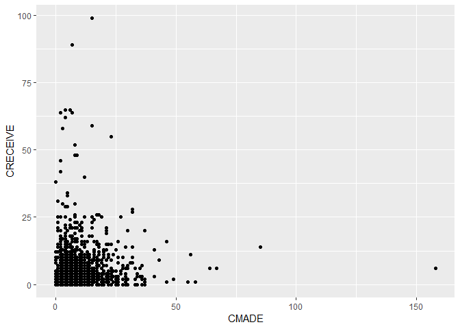

R Notebook: Improving Construct Validity in Studies of Technology
Transfer
================
Malcolm S. Townes
(July 09, 2019)

## Introduction

This is an R Notebook for an investigation of improving construct
validity in studies of technology transfer.

## Project Set Up

The following code chunk enables the R Notebook to integrate seemlessly
with the project organization format. This is normally included in the R
Notebook to simplify file calls and enable file portability but it has
been causing an error. Per Dr. Christopher Prener of Saint Louis
University, the error is generated because the `here::here()` function
has not been tested with certain combinations of functions. To work
around this problem, I’ve embedded the `here()` function where I enter a
file path when necessary.

``` r
knitr::opts_knit$set(root.dir = here::here())
```

## Load Dependencies

The following code chunk loads package dependencies required to perform
the necessary tasks. Basic tasks include importing, reading, wrangling,
and cleaning data; selecting a subset of the data; checking for unique
observations, and analyzing missing data.

``` r
library(tidyverse) # loads the basic R packages
library(here) # enables file portability
library(readr) # functions for reading data
library(dplyr) # functions for data wrangling
library(janitor) # functions for data cleaning
library(naniar) # functions for analyzing missing data
library(ggplot2) # functions for data visualizations
library(boot) # functions for regression analysis
library(ordinal) # functions for regression models for ordinal data
library(MASS) # functions for ordered logistic or probit regression
library(broom) # functions for tidying ordinal logistic regression models
library(gvlma) # functions for global validation of linear model assumptions
library(lmtest) # functions for testing linear regression models
library(leaps) # functions for regression subset selection
library(car) # companion to applied regression
library(aod) # functions to analyze overdispersed data counts and proportions
library(pscl) # contains function for McFadden's Pseudo R2 for logistic regression
library(ResourceSelection) # contains function for Hosmer-Lemdshow goodness of fit test
```

## Load Raw Data

The following code chunk imports the raw data from the `txt` file for
the NBER data set for the period 1963 to
1999.

``` r
DataRaw <- read.table(here("DataRaw","NBERpatents1963to1999/apat63_99.txt"), sep = ",", header = TRUE, fill = TRUE, dec = ".")
```

## Subset Data

The following code chunk creates a subset of the data for the period
1990 through 1995.

``` r
DataRaw %>% # subset data
  filter(GYEAR>=1990) %>%
  filter(GYEAR<=1995) -> DataSubset90to95
DataSubset90to95 <- as_tibble(DataSubset90to95) # convert data frame to tibble
```

## Sample Data

The following code chunk takes a sample of 2,000 cases from the data
subset for the period 1990 through 1995.

``` r
set.seed(1972)
Sample90to95 <- sample(1:nrow(DataSubset90to95), size = 2000, replace = TRUE, prob = NULL)
Sample90to95 <- DataSubset90to95[Sample90to95,]
Sample90to95 <- as_tibble(Sample90to95)
```

## Clean Data Phase 1

The following code chunk reorganizes the variables and eliminates
variables not used in the analysis.

``` r
Sample90to95 %>%
  dplyr::select(PATENT, GYEAR, CRECEIVE, CAT, CLAIMS, CMADE, GENERAL, ORIGINAL, FWDAPLAG, BCKGTLAG) -> Sample90to95A # Another package also has a `select()` function
```

## Inspect Sample Data

The following code chunk evaluates the data sample to determine if
additional data cleaning is necessary. It first checks for missing data
for each variable. It then checks for missing data for each variable in
each case. Then it checks for duplicate cases with the `PATENT` variable
to determine if that variable can be used as a unique identifier for
each case. Finally, it checks for duplicate cases across all variables
to ensure that each case is unique.

``` r
miss_var_summary(Sample90to95A, order = TRUE)
```

    ## # A tibble: 10 x 3
    ##    variable n_miss pct_miss
    ##    <chr>     <int>    <dbl>
    ##  1 GENERAL     327     16.4
    ##  2 FWDAPLAG    327     16.4
    ##  3 ORIGINAL     48      2.4
    ##  4 BCKGTLAG     34      1.7
    ##  5 PATENT        0      0  
    ##  6 GYEAR         0      0  
    ##  7 CRECEIVE      0      0  
    ##  8 CAT           0      0  
    ##  9 CLAIMS        0      0  
    ## 10 CMADE         0      0

``` r
miss_case_summary(Sample90to95A, order = TRUE)
```

    ## # A tibble: 2,000 x 3
    ##     case n_miss pct_miss
    ##    <int>  <int>    <dbl>
    ##  1   346      4       40
    ##  2   516      4       40
    ##  3   590      4       40
    ##  4  1176      4       40
    ##  5  1224      4       40
    ##  6  1470      4       40
    ##  7  1664      4       40
    ##  8  1792      4       40
    ##  9  1111      3       30
    ## 10  1337      3       30
    ## # ... with 1,990 more rows

``` r
get_dupes(Sample90to95A, PATENT)
```

    ## # A tibble: 4 x 11
    ##   PATENT dupe_count GYEAR CRECEIVE   CAT CLAIMS CMADE GENERAL ORIGINAL
    ##    <int>      <int> <int>    <int> <int>  <int> <int>   <dbl>    <dbl>
    ## 1 4.99e6          2  1991        0     1     15     9      NA    0.370
    ## 2 4.99e6          2  1991        0     1     15     9      NA    0.370
    ## 3 5.30e6          2  1994        0     1      2     6      NA    0.278
    ## 4 5.30e6          2  1994        0     1      2     6      NA    0.278
    ## # ... with 2 more variables: FWDAPLAG <dbl>, BCKGTLAG <dbl>

``` r
get_dupes(Sample90to95A)
```

    ## # A tibble: 4 x 11
    ##   PATENT GYEAR CRECEIVE   CAT CLAIMS CMADE GENERAL ORIGINAL FWDAPLAG
    ##    <int> <int>    <int> <int>  <int> <int>   <dbl>    <dbl>    <dbl>
    ## 1 4.99e6  1991        0     1     15     9      NA    0.370       NA
    ## 2 4.99e6  1991        0     1     15     9      NA    0.370       NA
    ## 3 5.30e6  1994        0     1      2     6      NA    0.278       NA
    ## 4 5.30e6  1994        0     1      2     6      NA    0.278       NA
    ## # ... with 2 more variables: BCKGTLAG <dbl>, dupe_count <int>

## Adjust for Missing Data

The following code chunk modifies cases with missing data, removes
duplicate cases, and then evaluates the data sample to determine if
additional cleaning is necessary. It first assigns a value of `0` to
instances of `NA` in the data for the `GENERAL` variable. It then
assigns a value of `1` to instances of `NA` in the data for the
`ORIGINAL` variable. For the `FWDAPLAG` and `BCKGTLAG` variables it
assigns the maximum value in the data for each variable to instances of
missing data. It then removes duplicate cases. The code chunk then
checks for missing data for each variable in each case and missing data
for each case. Then it checks for duplicate cases with the `PATENT`
variable to determine if that variable can be used as a unique
identifier for each observation. Finally, it checks for duplicate
observations across all variables to ensure that each case is unique.

``` r
Sample90to95B <- Sample90to95A
Sample90to95B$GENERAL[is.na(x=Sample90to95B$GENERAL)] <- 0
Sample90to95B$ORIGINAL[is.na(x=Sample90to95B$ORIGINAL)] <- 1
Sample90to95B$FWDAPLAG[is.na(x=Sample90to95B$FWDAPLAG)] <- max(Sample90to95B$FWDAPLAG, na.rm = TRUE)
Sample90to95B$BCKGTLAG[is.na(x=Sample90to95B$BCKGTLAG)] <- max(Sample90to95B$BCKGTLAG, na.rm = TRUE)

Sample90to95B %>%
  distinct() -> Sample90to95B

miss_var_summary(Sample90to95B, order = TRUE)
```

    ## # A tibble: 10 x 3
    ##    variable n_miss pct_miss
    ##    <chr>     <int>    <dbl>
    ##  1 PATENT        0        0
    ##  2 GYEAR         0        0
    ##  3 CRECEIVE      0        0
    ##  4 CAT           0        0
    ##  5 CLAIMS        0        0
    ##  6 CMADE         0        0
    ##  7 GENERAL       0        0
    ##  8 ORIGINAL      0        0
    ##  9 FWDAPLAG      0        0
    ## 10 BCKGTLAG      0        0

``` r
miss_case_summary(Sample90to95B, order = TRUE)
```

    ## # A tibble: 1,998 x 3
    ##     case n_miss pct_miss
    ##    <int>  <int>    <dbl>
    ##  1     1      0        0
    ##  2     2      0        0
    ##  3     3      0        0
    ##  4     4      0        0
    ##  5     5      0        0
    ##  6     6      0        0
    ##  7     7      0        0
    ##  8     8      0        0
    ##  9     9      0        0
    ## 10    10      0        0
    ## # ... with 1,988 more rows

``` r
get_dupes(Sample90to95B, PATENT)
```

    ## # A tibble: 0 x 11
    ## # ... with 11 variables: PATENT <int>, dupe_count <int>, GYEAR <int>,
    ## #   CRECEIVE <int>, CAT <int>, CLAIMS <int>, CMADE <int>, GENERAL <dbl>,
    ## #   ORIGINAL <dbl>, FWDAPLAG <dbl>, BCKGTLAG <dbl>

``` r
get_dupes(Sample90to95B)
```

    ## # A tibble: 0 x 11
    ## # ... with 11 variables: PATENT <int>, GYEAR <int>, CRECEIVE <int>,
    ## #   CAT <int>, CLAIMS <int>, CMADE <int>, GENERAL <dbl>, ORIGINAL <dbl>,
    ## #   FWDAPLAG <dbl>, BCKGTLAG <dbl>, dupe_count <int>

## Central Tendency

The following code chunk calculates measures of central tendency in the
sample data for each of the
    variables.

``` r
summary(Sample90to95B)
```

    ##      PATENT            GYEAR         CRECEIVE           CAT       
    ##  Min.   :4890423   Min.   :1990   Min.   : 0.000   Min.   :1.000  
    ##  1st Qu.:5034806   1st Qu.:1991   1st Qu.: 1.000   1st Qu.:2.000  
    ##  Median :5185746   Median :1993   Median : 3.000   Median :4.000  
    ##  Mean   :5184975   Mean   :1993   Mean   : 4.952   Mean   :3.725  
    ##  3rd Qu.:5336132   3rd Qu.:1994   3rd Qu.: 6.000   3rd Qu.:5.000  
    ##  Max.   :5479597   Max.   :1995   Max.   :99.000   Max.   :6.000  
    ##      CLAIMS           CMADE            GENERAL          ORIGINAL     
    ##  Min.   :  1.00   Min.   :  0.000   Min.   :0.0000   Min.   :0.0000  
    ##  1st Qu.:  6.00   1st Qu.:  4.000   1st Qu.:0.0000   1st Qu.:0.0000  
    ##  Median : 10.00   Median :  7.000   Median :0.0907   Median :0.4444  
    ##  Mean   : 12.69   Mean   :  8.398   Mean   :0.2578   Mean   :0.3828  
    ##  3rd Qu.: 17.00   3rd Qu.: 11.000   3rd Qu.:0.5000   3rd Qu.:0.6250  
    ##  Max.   :101.00   Max.   :158.000   Max.   :0.8800   Max.   :1.0000  
    ##     FWDAPLAG         BCKGTLAG    
    ##  Min.   : 0.000   Min.   : 0.00  
    ##  1st Qu.: 3.000   1st Qu.: 6.50  
    ##  Median : 4.000   Median :10.75  
    ##  Mean   : 4.959   Mean   :15.13  
    ##  3rd Qu.: 6.000   3rd Qu.:18.50  
    ##  Max.   :10.500   Max.   :85.14

## Histograms

The following code chunk displays histograms for the variables of
primary interest to enable visual inspection of the data to evaluate
whether or not they fit normal distributions. The code chunk generates
separate `png` files that are saved in the `Results` folder.

``` r
histoGYEAR <- ggplot() +
  geom_histogram(Sample90to95B, mapping = aes(GYEAR))
ggsave(here("results", "histogramGYEAR.png"), dpi = 300)

histoCRECEIVE <- ggplot() +
  geom_histogram(Sample90to95B, mapping = aes(CRECEIVE))
ggsave(here("Results", "histogramCRECEIVE.png"), dpi = 300)

histoCAT <- ggplot() +
  geom_histogram(Sample90to95B, mapping = aes(CAT))
ggsave(here("Results", "histogramCAT.png"), dpi = 300)

histoCLAIMS <- ggplot() +
  geom_histogram(Sample90to95B, mapping = aes(CLAIMS))
ggsave(here("Results", "histogramCLAIMS.png"), dpi = 300)

histoCMADE <- ggplot() +
  geom_histogram(Sample90to95B, mapping = aes(CMADE))
ggsave(here("Results", "histogramCMADE.png"), dpi = 300)

histoGENERAL <- ggplot() +
  geom_histogram(Sample90to95B, mapping = aes(GENERAL))
ggsave(here("Results", "histogramGENERAL.png"), dpi = 300)

histoORIGINAL <- ggplot() +
  geom_histogram(Sample90to95B, mapping = aes(ORIGINAL))
ggsave(here("Results", "histogramORIGINAL.png"), dpi = 300)

histoFWDAPLAG <- ggplot() +
  geom_histogram(Sample90to95B, mapping = aes(FWDAPLAG))
ggsave(here("Results", "histogramFWDAPLAG.png"), dpi = 300)

histoBCKGTLAG <- ggplot() +
  geom_histogram(Sample90to95B, mapping = aes(BCKGTLAG))
ggsave(here("Results", "histogramBCKGTLAG.png"), dpi = 300)
```

## Scatter Plots

The following code chunk displays scatter plots with `CRECEIVE` as the
dependent variable against each of the the primary independent variables
of interest to visually inspect for linear relationships between the
dependent variable and each of the independent variables. The code chunk
generates separate `png` files that are saved in the `Results` folder.

``` r
ggplot() +
  geom_point(Sample90to95B, mapping = aes(x = GYEAR, y = CRECEIVE))
```

<!-- -->

``` r
ggsave(here("results", "scatterCRECEIVEbyGYEAR.png"), dpi = 300)

ggplot() +
  geom_point(Sample90to95B, mapping = aes(x = CAT, y = CRECEIVE))
```

<!-- -->

``` r
ggsave(here("results", "scatterCRECEIVEbyCAT.png"), dpi = 300)

ggplot() +
  geom_point(Sample90to95B, mapping = aes(x = CLAIMS, y = CRECEIVE))
```

<!-- -->

``` r
ggsave(here("results", "scatterCRECEIVEbyCLAIMS.png"), dpi = 300)

ggplot() +
  geom_point(Sample90to95B, mapping = aes(x = CMADE, y = CRECEIVE))
```

<!-- -->

``` r
ggsave(here("results", "scatterCRECEIVEbyCMADE.png"), dpi = 300)

ggplot() +
  geom_point(Sample90to95B, mapping = aes(x = GENERAL, y = CRECEIVE))
```

<!-- -->

``` r
ggsave(here("results", "scatterCRECEIVEbyGENERAL.png"), dpi = 300)

ggplot() +
  geom_point(Sample90to95B, mapping = aes(x = ORIGINAL, y = CRECEIVE))
```

<!-- -->

``` r
ggsave(here("results", "scatterCRECEIVEbyORIGINAL.png"), dpi = 300)

ggplot() +
  geom_point(Sample90to95B, mapping = aes(x = FWDAPLAG, y = CRECEIVE))
```

<!-- -->

``` r
ggsave(here("results", "scatterCRECEIVEbyFWDAPLAG.png"), dpi = 300)

ggplot() +
  geom_point(Sample90to95B, mapping = aes(x = BCKGTLAG, y = CRECEIVE))
```

<!-- -->

``` r
ggsave(here("results", "scatterCRECEIVEbyBCKGTLAG.png"), dpi = 300)
```

## Q-Q Plots

The following code chunk displays Quantile-Quantile (Q-Q) plots to check
for normal distribution in the data sample for each variable of primary
interest. The code chunk generates separate `png` files that are saved
in the `Results` folder.

``` r
png(filename = here("Results", "QQplotGYEAR.png"))
qqnorm(Sample90to95B$GYEAR, pch = 1, frame = FALSE, 
       main = "Normal Q-Q Plot for GYEAR", xlab = "Theoretical Quantiles", ylab = "Sample Quantiles")
qqline(Sample90to95B$GYEAR, col = "green", lwd = 2)
dev.off()
```

    ## png 
    ##   2

``` r
png(filename = here("Results", "QQplotCReceive.png"))
qqnorm(Sample90to95B$CRECEIVE, pch = 1, frame = FALSE, 
       main = "Normal Q-Q Plot for CRECEIVE", xlab = "Theoretical Quantiles", ylab = "Sample Quantiles")
qqline(Sample90to95B$CRECEIVE, col = "green", lwd = 2, plot.it = TRUE)
dev.off()
```

    ## png 
    ##   2

``` r
png(filename = here("Results", "QQplotCLAIMS.png"))
qqnorm(Sample90to95B$CLAIMS, pch = 1, frame = FALSE, 
       main = "Normal Q-Q Plot for CLAIMS", xlab = "Theoretical Quantiles", ylab = "Sample Quantiles")
qqline(Sample90to95B$CLAIMS, col = "green", lwd = 2)
dev.off()
```

    ## png 
    ##   2

``` r
png(filename = here("Results", "QQplotCMADE.png"))
qqnorm(Sample90to95B$CMADE, pch = 1, frame = FALSE, 
       main = "Normal Q-Q Plot for CMADE", xlab = "Theoretical Quantiles", ylab = "Sample Quantiles")
qqline(Sample90to95B$CMADE, col = "green", lwd = 2)
dev.off()
```

    ## png 
    ##   2

``` r
png(filename = here("Results", "QQplotGENERAL.png"))
qqnorm(Sample90to95B$GENERAL, pch = 1, frame = FALSE, 
       main = "Normal Q-Q Plot for GENERAL", xlab = "Theoretical Quantiles", ylab = "Sample Quantiles")
qqline(Sample90to95B$GENERAL, col = "green", lwd = 2)
dev.off()
```

    ## png 
    ##   2

``` r
png(filename = here("Results", "QQplotORIGINAL.png"))
qqnorm(Sample90to95B$ORIGINAL, pch = 1, frame = FALSE, 
       main = "Normal Q-Q Plot for ORIGINAL", xlab = "Theoretical Quantiles", ylab = "Sample Quantiles")
qqline(Sample90to95B$ORIGINAL, col = "green", lwd = 2)
dev.off()
```

    ## png 
    ##   2

``` r
png(filename = here("Results", "QQplotFWDAPLAG.png"))
qqnorm(Sample90to95B$FWDAPLAG, pch = 1, frame = FALSE, 
       main = "Normal Q-Q Plot for FWDAPLAG", xlab = "Theoretical Quantiles", ylab = "Sample Quantiles")
qqline(Sample90to95B$FWDAPLAG, col = "green", lwd = 2)
dev.off()
```

    ## png 
    ##   2

``` r
png(filename = here("Results", "QQplotBCKGTLAG.png"))
qqnorm(Sample90to95B$BCKGTLAG, pch = 1, frame = FALSE, 
       main = "Normal Q-Q Plot for BCKGTALG", xlab = "Theoretical Quantiles", ylab = "Sample Quantiles")
qqline(Sample90to95B$BCKGTLAG, col = "green", lwd = 2)
dev.off()
```

    ## png 
    ##   2

## Pairwise Correlation Coefficients

The following code chunk calculates the pairwise correlation
coefficients for all variables in the sample data using the Pearson
product-moment correlation function.

``` r
Sample90to95corrmatrix <- cor(Sample90to95B)
view(Sample90to95corrmatrix)
```

## Clean Data 2

The following code chunk creates additional variables needed for the
binary logistic regression, ordinal logistic regression, and multiple
regression analyses and removes variables that will not be used. It
first creates a new variable called `CRECbinary` that converts the
`CRECEIVE` variable into a dichotomous variable. It then creates a
series of dummy variables for the nominal `CAT` variable to use in
multiple regression analysis.

``` r
Sample90to95B %>%
  mutate(CRECbinary = ifelse(CRECEIVE == 0, 0, 1)) %>%
  mutate(CAT01 = ifelse(CAT == 1, 1, 0)) %>%
  mutate(CAT02 = ifelse(CAT == 2, 1, 0)) %>%
  mutate(CAT03 = ifelse(CAT == 3, 1, 0)) %>%
  mutate(CAT04 = ifelse(CAT == 4, 1, 0)) %>%
  mutate(CAT05 = ifelse(CAT == 5, 1, 0)) %>%
  mutate(CAT06 = ifelse(CAT == 6, 1, 0)) -> Sample90to95C
```

## Observation Counts 1

The following code chunk determines the number of observations for each
outcome of each nominal and ordinal independent variable to determine if
the sample size is large enough for logistic regression analysis, which
requires at least 10 observations for the least frequent outcome for
each independent variable.

``` r
Sample90to95C %>%
  group_by(GYEAR) %>%
  summarize(n())
```

    ## # A tibble: 6 x 2
    ##   GYEAR `n()`
    ##   <int> <int>
    ## 1  1990   301
    ## 2  1991   339
    ## 3  1992   331
    ## 4  1993   332
    ## 5  1994   347
    ## 6  1995   348

``` r
Sample90to95C %>%
  group_by(CRECEIVE) %>%
  summarize(n())
```

    ## # A tibble: 48 x 2
    ##    CRECEIVE `n()`
    ##       <int> <int>
    ##  1        0   325
    ##  2        1   307
    ##  3        2   265
    ##  4        3   234
    ##  5        4   172
    ##  6        5   142
    ##  7        6    98
    ##  8        7    73
    ##  9        8    60
    ## 10        9    44
    ## # ... with 38 more rows

``` r
Sample90to95C %>%
  group_by(CRECbinary) %>%
  summarize(n())
```

    ## # A tibble: 2 x 2
    ##   CRECbinary `n()`
    ##        <dbl> <int>
    ## 1          0   325
    ## 2          1  1673

``` r
Sample90to95C %>%  
  group_by(CAT) %>%
  summarize(n())
```

    ## # A tibble: 6 x 2
    ##     CAT `n()`
    ##   <int> <int>
    ## 1     1   380
    ## 2     2   207
    ## 3     3   211
    ## 4     4   376
    ## 5     5   432
    ## 6     6   392

``` r
Sample90to95C %>%  
  group_by(CAT01) %>%
  summarize(n())
```

    ## # A tibble: 2 x 2
    ##   CAT01 `n()`
    ##   <dbl> <int>
    ## 1     0  1618
    ## 2     1   380

``` r
Sample90to95C %>%  
  group_by(CAT02) %>%
  summarize(n())
```

    ## # A tibble: 2 x 2
    ##   CAT02 `n()`
    ##   <dbl> <int>
    ## 1     0  1791
    ## 2     1   207

``` r
Sample90to95C %>%  
  group_by(CAT03) %>%
  summarize(n())
```

    ## # A tibble: 2 x 2
    ##   CAT03 `n()`
    ##   <dbl> <int>
    ## 1     0  1787
    ## 2     1   211

``` r
Sample90to95C %>%  
  group_by(CAT04) %>%
  summarize(n())
```

    ## # A tibble: 2 x 2
    ##   CAT04 `n()`
    ##   <dbl> <int>
    ## 1     0  1622
    ## 2     1   376

``` r
Sample90to95C %>%  
  group_by(CAT05) %>%
  summarize(n())
```

    ## # A tibble: 2 x 2
    ##   CAT05 `n()`
    ##   <dbl> <int>
    ## 1     0  1566
    ## 2     1   432

``` r
Sample90to95C %>%  
  group_by(CAT06) %>%
  summarize(n())
```

    ## # A tibble: 2 x 2
    ##   CAT06 `n()`
    ##   <dbl> <int>
    ## 1     0  1606
    ## 2     1   392

``` r
Sample90to95C %>%  
  group_by(CLAIMS) %>%
  summarize(n())
```

    ## # A tibble: 57 x 2
    ##    CLAIMS `n()`
    ##     <int> <int>
    ##  1      1    46
    ##  2      2    55
    ##  3      3   101
    ##  4      4   107
    ##  5      5   117
    ##  6      6   123
    ##  7      7   112
    ##  8      8   133
    ##  9      9   113
    ## 10     10   107
    ## # ... with 47 more rows

``` r
Sample90to95C %>%    
  group_by(CMADE) %>%
  summarize(n())
```

    ## # A tibble: 49 x 2
    ##    CMADE `n()`
    ##    <int> <int>
    ##  1     0    34
    ##  2     1   108
    ##  3     2   159
    ##  4     3   182
    ##  5     4   179
    ##  6     5   175
    ##  7     6   152
    ##  8     7   151
    ##  9     8   131
    ## 10     9   118
    ## # ... with 39 more rows

## Clean Data 3

The following code chunk groups cases where the outcome level for
`CRECEIVE` is greater than or equal to 15 citations cases for the
logistic regression analysis because most of those outcome levels do not
have enough cases individually for logistic regression analysis which
requires at least 10 cases for the least frequent outcome level of each
independent variable.

``` r
Sample90to95C %>% 
  mutate(CRECordinal = ifelse (CRECEIVE>=15,15,CRECEIVE)) -> Sample90to95C
Sample90to95C <- as_tibble(Sample90to95C) # convert data frame to tibble
```

## Observation Counts 2

The following code chunk checks the number of observations for each
outcome level of the new `CRECordinal` variable.

``` r
Sample90to95C %>%
  group_by(CRECordinal) %>%
  summarize(n())
```

    ## # A tibble: 16 x 2
    ##    CRECordinal `n()`
    ##          <dbl> <int>
    ##  1           0   325
    ##  2           1   307
    ##  3           2   265
    ##  4           3   234
    ##  5           4   172
    ##  6           5   142
    ##  7           6    98
    ##  8           7    73
    ##  9           8    60
    ## 10           9    44
    ## 11          10    43
    ## 12          11    33
    ## 13          12    26
    ## 14          13    18
    ## 15          14    19
    ## 16          15   139

## Binary Logistic Regression Analysis

The following code chunk uses the new dichotomous variable
`CRECbinomial` as the dependent variable in a binary logistic regression
analysis. It then displays the results. It also calculates the odds
ratio, McFadden pseudo R-squared, confidence intervals for the
coefficients, and Hosemer-Lemeshow goodness of fit
test.

``` r
logitCRECEIVE <- glm(CRECbinary ~ GYEAR + as.factor(CAT) + CMADE + CLAIMS + ORIGINAL + GENERAL + FWDAPLAG + BCKGTLAG, data = Sample90to95C, family = binomial, na.action = na.omit)
summary(logitCRECEIVE)
```

    ## 
    ## Call:
    ## glm(formula = CRECbinary ~ GYEAR + as.factor(CAT) + CMADE + CLAIMS + 
    ##     ORIGINAL + GENERAL + FWDAPLAG + BCKGTLAG, family = binomial, 
    ##     data = Sample90to95C, na.action = na.omit)
    ## 
    ## Deviance Residuals: 
    ##     Min       1Q   Median       3Q      Max  
    ## -0.3879   0.0000   0.0000   0.0000   2.6810  
    ## 
    ## Coefficients:
    ##                   Estimate Std. Error z value Pr(>|z|)
    ## (Intercept)      1.862e+01  4.195e+04   0.000    1.000
    ## GYEAR            3.122e-01  8.802e-01   0.355    0.723
    ## as.factor(CAT)2  5.187e+01  2.259e+05   0.000    1.000
    ## as.factor(CAT)3  5.759e+01  3.690e+04   0.002    0.999
    ## as.factor(CAT)4  7.629e+01  3.578e+04   0.002    0.998
    ## as.factor(CAT)5  1.854e+01  4.344e+04   0.000    1.000
    ## as.factor(CAT)6  6.174e+01  3.574e+04   0.002    0.999
    ## CMADE           -1.979e-02  1.877e-01  -0.105    0.916
    ## CLAIMS          -2.364e-02  1.741e-01  -0.136    0.892
    ## ORIGINAL         2.192e+00  4.565e+00   0.480    0.631
    ## GENERAL          7.098e+01  3.623e+04   0.002    0.998
    ## FWDAPLAG        -6.876e+01  2.461e+03  -0.028    0.978
    ## BCKGTLAG         2.785e-03  5.399e-02   0.052    0.959
    ## 
    ## (Dispersion parameter for binomial family taken to be 1)
    ## 
    ##     Null deviance: 1774.459  on 1997  degrees of freedom
    ## Residual deviance:    9.167  on 1985  degrees of freedom
    ## AIC: 35.167
    ## 
    ## Number of Fisher Scoring iterations: 25

``` r
coefs <- coef(logitCRECEIVE)

# Raise e to the coefficients
exp(coefs)
```

    ##     (Intercept)           GYEAR as.factor(CAT)2 as.factor(CAT)3 
    ##    1.222174e+08    1.366461e+00    3.365555e+22    1.023373e+25 
    ## as.factor(CAT)4 as.factor(CAT)5 as.factor(CAT)6           CMADE 
    ##    1.358901e+33    1.129561e+08    6.530469e+26    9.804027e-01 
    ##          CLAIMS        ORIGINAL         GENERAL        FWDAPLAG 
    ##    9.766327e-01    8.956214e+00    6.686125e+30    1.375684e-30 
    ##        BCKGTLAG 
    ##    1.002789e+00

``` r
# Obtain the McFadden pseudo R-squared
pR2(logitCRECEIVE)
```

    ##          llh      llhNull           G2     McFadden         r2ML 
    ##   -4.5834781 -887.2297285 1765.2925008    0.9948339    0.5866786 
    ##         r2CU 
    ##    0.9967854

``` r
# Confidence intervals for the coefficients
confint(logitCRECEIVE, level = 0.95)
```

    ##                         2.5 %        97.5 %
    ## (Intercept)     -1.826634e+03  1863.8768502
    ## GYEAR           -1.172910e+00     3.1238384
    ## as.factor(CAT)2 -1.318477e+04 12167.4434610
    ## as.factor(CAT)3 -1.931872e+03  1946.4876791
    ## as.factor(CAT)4 -1.497483e+03  1650.0673202
    ## as.factor(CAT)5 -1.713920e+03  2004.7750073
    ## as.factor(CAT)6 -1.609277e+03  1805.9906612
    ## CMADE           -6.494402e-01     0.2746325
    ## CLAIMS          -5.800099e-01     0.2256378
    ## ORIGINAL        -6.365958e+00    14.7947578
    ## GENERAL         -1.362734e+03  1526.2734452
    ## FWDAPLAG        -5.237472e+02 -1119.5494180
    ## BCKGTLAG        -1.688275e-01     0.1194676

``` r
# Hosemer-Lemeshow Goodness of Fit Test
GOF <- hoslem.test(Sample90to95C$CRECbinary, fitted(logitCRECEIVE), g=10)
summary(GOF)
```

    ##           Length Class  Mode     
    ## statistic 1      -none- numeric  
    ## parameter 1      -none- numeric  
    ## p.value   1      -none- numeric  
    ## method    1      -none- character
    ## data.name 1      -none- character
    ## observed  4      xtabs  numeric  
    ## expected  4      xtabs  numeric

``` r
cbind(GOF$expected, GOF$observed)
```

    ##                     yhat0        yhat1  y0   y1
    ## [2.22e-16,1.25e-10]   200 1.148984e-09 200    0
    ## (1.25e-10,1]          125 1.673000e+03 125 1673

## Ordinal Logistic Regression Analysis

The following code chunk performs an ordinal logistic regression
analysis on the data sample using `CRECEIVE` as the dependent variable.
It then displays the results. It performs the analysis two different
ways for comparison.

``` r
# Ordinal Logistic Regression Results - Method 01
CRECEIVEordinal <- clm(as.factor(CRECordinal) ~ GYEAR + as.factor(CAT) + CMADE + CLAIMS + ORIGINAL + GENERAL + FWDAPLAG + BCKGTLAG, data = Sample90to95C)
summary(CRECEIVEordinal)
```

    ## formula: 
    ## as.factor(CRECordinal) ~ GYEAR + as.factor(CAT) + CMADE + CLAIMS + ORIGINAL + GENERAL + FWDAPLAG + BCKGTLAG
    ## data:    Sample90to95C
    ## 
    ##  link  threshold nobs logLik   AIC     niter max.grad cond.H 
    ##  logit flexible  1998 -3952.10 7958.20 7(2)  4.51e-07 9.9e+13
    ## 
    ## Coefficients:
    ##                  Estimate Std. Error z value Pr(>|z|)    
    ## GYEAR           -0.365924   0.026953 -13.577  < 2e-16 ***
    ## as.factor(CAT)2  0.942450   0.163457   5.766 8.13e-09 ***
    ## as.factor(CAT)3  0.928549   0.164576   5.642 1.68e-08 ***
    ## as.factor(CAT)4  0.493043   0.136760   3.605 0.000312 ***
    ## as.factor(CAT)5  0.034448   0.134614   0.256 0.798027    
    ## as.factor(CAT)6  0.297271   0.135203   2.199 0.027899 *  
    ## CMADE            0.024240   0.005091   4.761 1.92e-06 ***
    ## CLAIMS           0.017572   0.004548   3.864 0.000112 ***
    ## ORIGINAL        -0.852045   0.157334  -5.416 6.11e-08 ***
    ## GENERAL          4.644408   0.185912  24.982  < 2e-16 ***
    ## FWDAPLAG        -0.488523   0.021583 -22.634  < 2e-16 ***
    ## BCKGTLAG        -0.006676   0.003265  -2.044 0.040926 *  
    ## ---
    ## Signif. codes:  0 '***' 0.001 '**' 0.01 '*' 0.05 '.' 0.1 ' ' 1
    ## 
    ## Threshold coefficients:
    ##       Estimate Std. Error z value
    ## 0|1    -733.01      53.75  -13.64
    ## 1|2    -730.94      53.73  -13.60
    ## 2|3    -729.88      53.73  -13.59
    ## 3|4    -729.10      53.73  -13.57
    ## 4|5    -728.54      53.72  -13.56
    ## 5|6    -728.07      53.72  -13.55
    ## 6|7    -727.72      53.72  -13.55
    ## 7|8    -727.43      53.72  -13.54
    ## 8|9    -727.17      53.72  -13.54
    ## 9|10   -726.95      53.72  -13.53
    ## 10|11  -726.72      53.72  -13.53
    ## 11|12  -726.52      53.72  -13.53
    ## 12|13  -726.34      53.72  -13.52
    ## 13|14  -726.21      53.72  -13.52
    ## 14|15  -726.05      53.71  -13.52

``` r
# Ordinal Logistic Regression Results - Method 02
CRECEIVEordinal01 <- polr(as.factor(CRECordinal) ~ GYEAR + as.factor(CAT) + CMADE + CLAIMS + ORIGINAL + GENERAL + FWDAPLAG + BCKGTLAG, data = Sample90to95C, Hess = TRUE, model = TRUE, method = "logistic")
summary(CRECEIVEordinal01)
```

    ## Call:
    ## polr(formula = as.factor(CRECordinal) ~ GYEAR + as.factor(CAT) + 
    ##     CMADE + CLAIMS + ORIGINAL + GENERAL + FWDAPLAG + BCKGTLAG, 
    ##     data = Sample90to95C, Hess = TRUE, model = TRUE, method = "logistic")
    ## 
    ## Coefficients:
    ##                     Value Std. Error    t value
    ## GYEAR           -0.365915  9.756e-05 -3750.5274
    ## as.factor(CAT)2  0.942448  1.115e-01     8.4527
    ## as.factor(CAT)3  0.928546  1.095e-01     8.4802
    ## as.factor(CAT)4  0.493042  9.072e-02     5.4347
    ## as.factor(CAT)5  0.034456  8.924e-02     0.3861
    ## as.factor(CAT)6  0.297260  9.029e-02     3.2922
    ## CMADE            0.024240  5.009e-03     4.8389
    ## CLAIMS           0.017572  4.546e-03     3.8649
    ## ORIGINAL        -0.852066  1.236e-01    -6.8949
    ## GENERAL          4.644389  6.795e-02    68.3507
    ## FWDAPLAG        -0.488513  2.004e-02   -24.3722
    ## BCKGTLAG        -0.006675  3.241e-03    -2.0599
    ## 
    ## Intercepts:
    ##       Value        Std. Error   t value     
    ## 0|1      -732.9911       0.0020 -369549.4531
    ## 1|2      -730.9229       0.1050   -6958.2905
    ## 2|3      -729.8599       0.1114   -6549.0132
    ## 3|4      -729.0789       0.1144   -6373.8457
    ## 4|5      -728.5245       0.1166   -6248.4878
    ## 5|6      -728.0492       0.1189   -6122.7410
    ## 6|7      -727.6995       0.1209   -6018.6841
    ## 7|8      -727.4124       0.1228   -5922.1601
    ## 8|9      -727.1485       0.1249   -5823.4243
    ## 9|10     -726.9330       0.1265   -5745.7368
    ## 10|11    -726.6987       0.1287   -5644.7307
    ## 11|12    -726.4988       0.1303   -5575.8923
    ## 12|13    -726.3228       0.1312   -5537.6347
    ## 13|14    -726.1877       0.1315   -5524.3396
    ## 14|15    -726.0301       0.1318   -5508.7824
    ## 
    ## Residual Deviance: 7904.203 
    ## AIC: 7958.203

``` r
# Calculate P-Values for Coefficients
coefsOrdinal <- coefficients(summary(CRECEIVEordinal01))
pvalues <- pt(abs(coefsOrdinal)[,"t value"], df=CRECEIVEordinal01$df,lower.tail = FALSE)*2
pval <- pnorm(abs(coefsOrdinal)[,"t value"],lower.tail = FALSE)*2
coefsOrdinal01 <- cbind(coefsOrdinal, "p values (t dist)" = round(pvalues, 5))
coefsOrdinal01 <- cbind(coefsOrdinal01, "p values (Normal)" = round(pval, 5))
print("Ordinal Logistic Regression Results with P-values")
```

    ## [1] "Ordinal Logistic Regression Results with P-values"

``` r
summary(coefsOrdinal01)
```

    ##      Value             Std. Error           t value         
    ##  Min.   :-732.9911   Min.   :9.756e-05   Min.   :-369549.5  
    ##  1st Qu.:-727.5559   1st Qu.:7.859e-02   1st Qu.:  -5970.4  
    ##  Median :-726.1877   Median :1.115e-01   Median :  -5524.3  
    ##  Mean   :-404.2478   Mean   :9.010e-02   Mean   : -16917.9  
    ##  3rd Qu.:   0.0209   3rd Qu.:1.242e-01   3rd Qu.:      1.8  
    ##  Max.   :   4.6444   Max.   :1.318e-01   Max.   :     68.4  
    ##  p values (t dist) p values (Normal)
    ##  Min.   :0.00000   Min.   :0.0000   
    ##  1st Qu.:0.00000   1st Qu.:0.0000   
    ##  Median :0.00000   Median :0.0000   
    ##  Mean   :0.02741   Mean   :0.0274   
    ##  3rd Qu.:0.00000   3rd Qu.:0.0000   
    ##  Max.   :0.69946   Max.   :0.6994

## Multiple Regression Model Selection

The following code chunk creates regression subsets using the exhaustive
method with `CRECEIVE` as the dependent variable. It then displays the
summary statistics to facilitate selection of the best regression model
on which to
focus.

``` r
CRECregsubsets <- regsubsets(CRECEIVE ~ GYEAR + as.factor(CAT) + CMADE + CLAIMS + ORIGINAL + GENERAL + FWDAPLAG + BCKGTLAG, data = Sample90to95C, nbest = 2, method = "exhaustive")
summary(CRECregsubsets,all.best=TRUE, matrix=TRUE)
```

    ## Subset selection object
    ## Call: regsubsets.formula(CRECEIVE ~ GYEAR + as.factor(CAT) + CMADE + 
    ##     CLAIMS + ORIGINAL + GENERAL + FWDAPLAG + BCKGTLAG, data = Sample90to95C, 
    ##     nbest = 2, method = "exhaustive")
    ## 12 Variables  (and intercept)
    ##                 Forced in Forced out
    ## GYEAR               FALSE      FALSE
    ## as.factor(CAT)2     FALSE      FALSE
    ## as.factor(CAT)3     FALSE      FALSE
    ## as.factor(CAT)4     FALSE      FALSE
    ## as.factor(CAT)5     FALSE      FALSE
    ## as.factor(CAT)6     FALSE      FALSE
    ## CMADE               FALSE      FALSE
    ## CLAIMS              FALSE      FALSE
    ## ORIGINAL            FALSE      FALSE
    ## GENERAL             FALSE      FALSE
    ## FWDAPLAG            FALSE      FALSE
    ## BCKGTLAG            FALSE      FALSE
    ## 2 subsets of each size up to 8
    ## Selection Algorithm: exhaustive
    ##          GYEAR as.factor(CAT)2 as.factor(CAT)3 as.factor(CAT)4
    ## 1  ( 1 ) " "   " "             " "             " "            
    ## 1  ( 2 ) " "   " "             " "             " "            
    ## 2  ( 1 ) " "   " "             "*"             " "            
    ## 2  ( 2 ) " "   "*"             " "             " "            
    ## 3  ( 1 ) " "   "*"             "*"             " "            
    ## 3  ( 2 ) "*"   " "             "*"             " "            
    ## 4  ( 1 ) "*"   "*"             "*"             " "            
    ## 4  ( 2 ) " "   "*"             "*"             " "            
    ## 5  ( 1 ) "*"   "*"             "*"             " "            
    ## 5  ( 2 ) "*"   "*"             "*"             " "            
    ## 6  ( 1 ) "*"   "*"             "*"             " "            
    ## 6  ( 2 ) "*"   "*"             "*"             "*"            
    ## 7  ( 1 ) "*"   "*"             "*"             "*"            
    ## 7  ( 2 ) "*"   "*"             "*"             " "            
    ## 8  ( 1 ) "*"   "*"             "*"             "*"            
    ## 8  ( 2 ) "*"   "*"             "*"             "*"            
    ##          as.factor(CAT)5 as.factor(CAT)6 CMADE CLAIMS ORIGINAL GENERAL
    ## 1  ( 1 ) " "             " "             " "   " "    " "      "*"    
    ## 1  ( 2 ) " "             " "             " "   " "    " "      " "    
    ## 2  ( 1 ) " "             " "             " "   " "    " "      "*"    
    ## 2  ( 2 ) " "             " "             " "   " "    " "      "*"    
    ## 3  ( 1 ) " "             " "             " "   " "    " "      "*"    
    ## 3  ( 2 ) " "             " "             " "   " "    " "      "*"    
    ## 4  ( 1 ) " "             " "             " "   " "    " "      "*"    
    ## 4  ( 2 ) " "             " "             " "   " "    "*"      "*"    
    ## 5  ( 1 ) " "             " "             " "   " "    " "      "*"    
    ## 5  ( 2 ) " "             " "             " "   "*"    " "      "*"    
    ## 6  ( 1 ) " "             " "             " "   "*"    " "      "*"    
    ## 6  ( 2 ) " "             " "             " "   " "    " "      "*"    
    ## 7  ( 1 ) " "             " "             " "   "*"    " "      "*"    
    ## 7  ( 2 ) " "             " "             " "   "*"    "*"      "*"    
    ## 8  ( 1 ) " "             " "             " "   "*"    "*"      "*"    
    ## 8  ( 2 ) " "             " "             " "   "*"    " "      "*"    
    ##          FWDAPLAG BCKGTLAG
    ## 1  ( 1 ) " "      " "     
    ## 1  ( 2 ) "*"      " "     
    ## 2  ( 1 ) " "      " "     
    ## 2  ( 2 ) " "      " "     
    ## 3  ( 1 ) " "      " "     
    ## 3  ( 2 ) " "      " "     
    ## 4  ( 1 ) " "      " "     
    ## 4  ( 2 ) " "      " "     
    ## 5  ( 1 ) "*"      " "     
    ## 5  ( 2 ) " "      " "     
    ## 6  ( 1 ) "*"      " "     
    ## 6  ( 2 ) "*"      " "     
    ## 7  ( 1 ) "*"      " "     
    ## 7  ( 2 ) "*"      " "     
    ## 8  ( 1 ) "*"      " "     
    ## 8  ( 2 ) "*"      "*"

``` r
plot(CRECregsubsets, scale = "adjr2")
```

<!-- -->

## Multiple Regression Analysis

The following code chunk performs a multiple regression analysis on the
data sample using the selected model. It then displays the results.

``` r
# Multiple Regression
CRECEIVEregression <- lm(CRECEIVE ~ GYEAR + CAT02 + CAT03 + CAT04 + CLAIMS + ORIGINAL + GENERAL + FWDAPLAG, data = Sample90to95C, na.action = na.omit)
summary(CRECEIVEregression)
```

    ## 
    ## Call:
    ## lm(formula = CRECEIVE ~ GYEAR + CAT02 + CAT03 + CAT04 + CLAIMS + 
    ##     ORIGINAL + GENERAL + FWDAPLAG, data = Sample90to95C, na.action = na.omit)
    ## 
    ## Residuals:
    ##     Min      1Q  Median      3Q     Max 
    ## -10.593  -2.956  -0.850   1.035  87.029 
    ## 
    ## Coefficients:
    ##              Estimate Std. Error t value Pr(>|t|)    
    ## (Intercept) 998.65051  171.81537   5.812 7.16e-09 ***
    ## GYEAR        -0.49997    0.08621  -5.799 7.73e-09 ***
    ## CAT02         3.05106    0.48425   6.301 3.64e-10 ***
    ## CAT03         3.45773    0.47537   7.274 5.01e-13 ***
    ## CAT04         1.37359    0.37734   3.640 0.000279 ***
    ## CLAIMS        0.05989    0.01527   3.921 9.13e-05 ***
    ## ORIGINAL     -1.55882    0.50028  -3.116 0.001860 ** 
    ## GENERAL       9.57013    0.56144  17.046  < 2e-16 ***
    ## FWDAPLAG     -0.21028    0.05332  -3.944 8.31e-05 ***
    ## ---
    ## Signif. codes:  0 '***' 0.001 '**' 0.01 '*' 0.05 '.' 0.1 ' ' 1
    ## 
    ## Residual standard error: 6.357 on 1989 degrees of freedom
    ## Multiple R-squared:  0.2373, Adjusted R-squared:  0.2342 
    ## F-statistic: 77.36 on 8 and 1989 DF,  p-value: < 2.2e-16

## Check Linear Regression Assumptions

The following code chunk performs various checks to determine if the
model satisfies the assumptions of linear regression.

``` r
# Global check of linear regression assumptions
par(mfrow=c(2,2))
gvlma(CRECEIVEregression)
```

    ## 
    ## Call:
    ## lm(formula = CRECEIVE ~ GYEAR + CAT02 + CAT03 + CAT04 + CLAIMS + 
    ##     ORIGINAL + GENERAL + FWDAPLAG, data = Sample90to95C, na.action = na.omit)
    ## 
    ## Coefficients:
    ## (Intercept)        GYEAR        CAT02        CAT03        CAT04  
    ##   998.65051     -0.49997      3.05106      3.45773      1.37359  
    ##      CLAIMS     ORIGINAL      GENERAL     FWDAPLAG  
    ##     0.05989     -1.55882      9.57013     -0.21028  
    ## 
    ## 
    ## ASSESSMENT OF THE LINEAR MODEL ASSUMPTIONS
    ## USING THE GLOBAL TEST ON 4 DEGREES-OF-FREEDOM:
    ## Level of Significance =  0.05 
    ## 
    ## Call:
    ##  gvlma(x = CRECEIVEregression) 
    ## 
    ##                        Value   p-value                   Decision
    ## Global Stat        210438.23 0.000e+00 Assumptions NOT satisfied!
    ## Skewness             9785.54 0.000e+00 Assumptions NOT satisfied!
    ## Kurtosis           200585.30 0.000e+00 Assumptions NOT satisfied!
    ## Link Function          29.73 4.959e-08 Assumptions NOT satisfied!
    ## Heteroscedasticity     37.66 8.424e-10 Assumptions NOT satisfied!

``` r
# Residuals
png(filename = here("Results","MultRegresPlotResiduals.png"))
CRECEIVEresid <- residuals(CRECEIVEregression)
plot(CRECEIVEresid)
dev.off()
```

    ## png 
    ##   2

``` r
# Check for homoscedasticity of residuals or equal variance
# Check for normality of residuals
png(filename = here("Results", "MultRegresQQplotModelResiduals01.png"))
par(mfrow=c(2,2))
plot(CRECEIVEregression)
dev.off()
```

    ## png 
    ##   2

``` r
# Check for autocorrelation of residuals using Durbin-Watson test
AutoCorr <- dwtest(CRECEIVEregression)
print(AutoCorr)
```

    ## 
    ##  Durbin-Watson test
    ## 
    ## data:  CRECEIVEregression
    ## DW = 1.9843, p-value = 0.3622
    ## alternative hypothesis: true autocorrelation is greater than 0

``` r
# Check that the independent variables and the residuals are uncorrelated
CorrGYEAR <- cor.test(Sample90to95C$GYEAR, CRECEIVEregression$residuals)
print(CorrGYEAR)
```

    ## 
    ##  Pearson's product-moment correlation
    ## 
    ## data:  Sample90to95C$GYEAR and CRECEIVEregression$residuals
    ## t = -1.598e-11, df = 1996, p-value = 1
    ## alternative hypothesis: true correlation is not equal to 0
    ## 95 percent confidence interval:
    ##  -0.04385287  0.04385287
    ## sample estimates:
    ##           cor 
    ## -3.576716e-13

``` r
CorrCAT <- cor.test(Sample90to95C$CAT, CRECEIVEregression$residuals)
print(CorrCAT)
```

    ## 
    ##  Pearson's product-moment correlation
    ## 
    ## data:  Sample90to95C$CAT and CRECEIVEregression$residuals
    ## t = -0.19801, df = 1996, p-value = 0.8431
    ## alternative hypothesis: true correlation is not equal to 0
    ## 95 percent confidence interval:
    ##  -0.04827556  0.03942846
    ## sample estimates:
    ##          cor 
    ## -0.004432068

``` r
CorrCLAIMS <- cor.test(Sample90to95C$CLAIMS, CRECEIVEregression$residuals)
print(CorrCLAIMS)
```

    ## 
    ##  Pearson's product-moment correlation
    ## 
    ## data:  Sample90to95C$CLAIMS and CRECEIVEregression$residuals
    ## t = 1.4501e-17, df = 1996, p-value = 1
    ## alternative hypothesis: true correlation is not equal to 0
    ## 95 percent confidence interval:
    ##  -0.04385287  0.04385287
    ## sample estimates:
    ##          cor 
    ## 3.245828e-19

``` r
CorrORIGINAL <- cor.test(Sample90to95C$ORIGINAL, CRECEIVEregression$residuals)
print(CorrORIGINAL)
```

    ## 
    ##  Pearson's product-moment correlation
    ## 
    ## data:  Sample90to95C$ORIGINAL and CRECEIVEregression$residuals
    ## t = 9.1473e-16, df = 1996, p-value = 1
    ## alternative hypothesis: true correlation is not equal to 0
    ## 95 percent confidence interval:
    ##  -0.04385287  0.04385287
    ## sample estimates:
    ##          cor 
    ## 2.047445e-17

``` r
CorrGENERAL <- cor.test(Sample90to95C$GENERAL, CRECEIVEregression$residuals)
print(CorrGENERAL)
```

    ## 
    ##  Pearson's product-moment correlation
    ## 
    ## data:  Sample90to95C$GENERAL and CRECEIVEregression$residuals
    ## t = -1.1524e-15, df = 1996, p-value = 1
    ## alternative hypothesis: true correlation is not equal to 0
    ## 95 percent confidence interval:
    ##  -0.04385287  0.04385287
    ## sample estimates:
    ##           cor 
    ## -2.579462e-17

``` r
CorrFWDAPLAG <- cor.test(Sample90to95C$FWDAPLAG, CRECEIVEregression$residuals)
print(CorrFWDAPLAG)
```

    ## 
    ##  Pearson's product-moment correlation
    ## 
    ## data:  Sample90to95C$FWDAPLAG and CRECEIVEregression$residuals
    ## t = -3.946e-15, df = 1996, p-value = 1
    ## alternative hypothesis: true correlation is not equal to 0
    ## 95 percent confidence interval:
    ##  -0.04385287  0.04385287
    ## sample estimates:
    ##          cor 
    ## -8.83242e-17

``` r
# Check that the variability in independent variable values is positive
VarRegression <- var(Sample90to95C)
print(VarRegression)
```

    ##                    PATENT         GYEAR      CRECEIVE           CAT
    ## PATENT       2.896022e+10  2.847921e+05 -1.966105e+05 -1.015111e+04
    ## GYEAR        2.847921e+05  2.882845e+00 -1.843425e+00 -8.101116e-02
    ## CRECEIVE    -1.966105e+05 -1.843425e+00  5.277040e+01 -1.234403e+00
    ## CAT         -1.015111e+04 -8.101116e-02 -1.234403e+00  3.158813e+00
    ## CLAIMS       6.520031e+04  6.439837e-01  9.005697e+00 -2.885251e-01
    ## CMADE        1.404069e+05  1.290039e+00  3.703980e+00  5.762247e-01
    ## GENERAL     -6.018177e+03 -5.647784e-02  8.485036e-01 -5.243584e-02
    ## ORIGINAL     4.025316e+03  4.045554e-02  2.843642e-03 -3.176534e-02
    ## FWDAPLAG    -5.388636e+04 -5.080258e-01 -4.093814e+00  7.535903e-02
    ## BCKGTLAG    -2.778372e+04 -1.834319e-01 -1.427896e+01  4.534177e+00
    ## CRECbinary  -7.390528e+03 -7.528986e-02  8.059825e-01 -1.317066e-02
    ## CAT01        4.983723e+02  1.378444e-04 -1.562003e-01 -5.185706e-01
    ## CAT02        1.795055e+03  1.904433e-02  3.279130e-01 -1.788291e-01
    ## CAT03       -1.121108e+03 -1.163181e-02  2.779332e-01 -7.662620e-02
    ## CAT04        2.923029e+03  2.780948e-02  9.007405e-02  5.173526e-02
    ## CAT05       -2.003705e+03 -1.657892e-02 -3.101950e-01  2.757650e-01
    ## CAT06       -2.091643e+03 -1.878092e-02 -2.295250e-01  4.465256e-01
    ## CRECordinal -1.541875e+05 -1.487075e+00  2.561643e+01 -7.408049e-01
    ##                    CLAIMS         CMADE       GENERAL      ORIGINAL
    ## PATENT       6.520031e+04  1.404069e+05 -6.018177e+03  4.025316e+03
    ## GYEAR        6.439837e-01  1.290039e+00 -5.647784e-02  4.045554e-02
    ## CRECEIVE     9.005697e+00  3.703980e+00  8.485036e-01  2.843642e-03
    ## CAT         -2.885251e-01  5.762247e-01 -5.243584e-02 -3.176534e-02
    ## CLAIMS       8.860728e+01  1.256695e+01  3.161584e-01  9.700124e-02
    ## CMADE        1.256695e+01  6.500294e+01  1.989006e-01  6.008840e-01
    ## GENERAL      3.161584e-01  1.989006e-01  7.826721e-02  1.769552e-02
    ## ORIGINAL     9.700124e-02  6.008840e-01  1.769552e-02  8.673389e-02
    ## FWDAPLAG    -2.231889e+00 -1.682757e+00 -2.363563e-01 -7.738447e-03
    ## BCKGTLAG    -9.740716e+00  1.530772e+00 -4.312312e-01  1.007001e+00
    ## CRECbinary   3.153035e-01  2.180668e-01  4.194818e-02  8.232704e-04
    ## CAT01       -5.634027e-02 -2.122754e-02  4.828916e-03  1.138813e-02
    ## CAT02        9.992241e-02 -1.214164e-01  9.840877e-03 -1.327705e-03
    ## CAT03        7.851392e-02  6.506657e-02  6.029517e-05 -3.258091e-03
    ## CAT04        7.373122e-02 -5.197686e-02 -3.251499e-05 -2.326255e-03
    ## CAT05       -2.124673e-01 -7.566756e-02 -1.118810e-02 -5.437690e-03
    ## CAT06        1.664008e-02  2.052217e-01 -3.509474e-03  9.616145e-04
    ## CRECordinal  6.480824e+00  3.460179e+00  6.450770e-01  1.308021e-02
    ##                  FWDAPLAG      BCKGTLAG    CRECbinary         CAT01
    ## PATENT      -5.388636e+04 -2.778372e+04 -7.390528e+03  4.983723e+02
    ## GYEAR       -5.080258e-01 -1.834319e-01 -7.528986e-02  1.378444e-04
    ## CRECEIVE    -4.093814e+00 -1.427896e+01  8.059825e-01 -1.562003e-01
    ## CAT          7.535903e-02  4.534177e+00 -1.317066e-02 -5.185706e-01
    ## CLAIMS      -2.231889e+00 -9.740716e+00  3.153035e-01 -5.634027e-02
    ## CMADE       -1.682757e+00  1.530772e+00  2.180668e-01 -2.122754e-02
    ## GENERAL     -2.363563e-01 -4.312312e-01  4.194818e-02  4.828916e-03
    ## ORIGINAL    -7.738447e-03  1.007001e+00  8.232704e-04  1.138813e-02
    ## FWDAPLAG     8.095435e+00  5.397331e+00 -9.017406e-01  5.343921e-02
    ## BCKGTLAG     5.397331e+00  2.099605e+02 -6.525785e-01 -5.235270e-02
    ## CRECbinary  -9.017406e-01 -6.525785e-01  1.362717e-01 -7.104751e-03
    ## CAT01        5.343921e-02 -5.235270e-02 -7.104751e-03  1.540950e-01
    ## CAT02       -7.777277e-02 -7.359594e-01  1.085186e-02 -1.971426e-02
    ## CAT03        2.038181e-02 -1.840212e-01  6.619038e-04 -2.009521e-02
    ## CAT04       -6.925563e-02 -6.170772e-01  6.590466e-03 -3.580947e-02
    ## CAT05        4.590183e-02  4.576425e-01 -9.879684e-03 -4.114280e-02
    ## CAT06        2.730555e-02  1.131768e+00 -1.119798e-03 -3.733328e-02
    ## CRECordinal -3.831362e+00 -1.031416e+01  7.006631e-01 -9.965749e-02
    ##                     CAT02         CAT03         CAT04         CAT05
    ## PATENT       1.795055e+03 -1.121108e+03  2.923029e+03 -2.003705e+03
    ## GYEAR        1.904433e-02 -1.163181e-02  2.780948e-02 -1.657892e-02
    ## CRECEIVE     3.279130e-01  2.779332e-01  9.007405e-02 -3.101950e-01
    ## CAT         -1.788291e-01 -7.662620e-02  5.173526e-02  2.757650e-01
    ## CLAIMS       9.992241e-02  7.851392e-02  7.373122e-02 -2.124673e-01
    ## CMADE       -1.214164e-01  6.506657e-02 -5.197686e-02 -7.566756e-02
    ## GENERAL      9.840877e-03  6.029517e-05 -3.251499e-05 -1.118810e-02
    ## ORIGINAL    -1.327705e-03 -3.258091e-03 -2.326255e-03 -5.437690e-03
    ## FWDAPLAG    -7.777277e-02  2.038181e-02 -6.925563e-02  4.590183e-02
    ## BCKGTLAG    -7.359594e-01 -1.840212e-01 -6.170772e-01  4.576425e-01
    ## CRECbinary   1.085186e-02  6.619038e-04  6.590466e-03 -9.879684e-03
    ## CAT01       -1.971426e-02 -2.009521e-02 -3.580947e-02 -4.114280e-02
    ## CAT02        9.291640e-02 -1.094660e-02 -1.950674e-02 -2.241200e-02
    ## CAT03       -1.094660e-02  9.450036e-02 -1.988368e-02 -2.284508e-02
    ## CAT04       -1.950674e-02 -1.988368e-02  1.528499e-01 -4.070971e-02
    ## CAT05       -2.241200e-02 -2.284508e-02 -4.070971e-02  1.695516e-01
    ## CAT06       -2.033681e-02 -2.072979e-02 -3.694030e-02 -4.244204e-02
    ## CRECordinal  2.277425e-01  1.425040e-01  5.518538e-02 -2.097606e-01
    ##                     CAT06   CRECordinal
    ## PATENT      -2.091643e+03 -1.541875e+05
    ## GYEAR       -1.878092e-02 -1.487075e+00
    ## CRECEIVE    -2.295250e-01  2.561643e+01
    ## CAT          4.465256e-01 -7.408049e-01
    ## CLAIMS       1.664008e-02  6.480824e+00
    ## CMADE        2.052217e-01  3.460179e+00
    ## GENERAL     -3.509474e-03  6.450770e-01
    ## ORIGINAL     9.616145e-04  1.308021e-02
    ## FWDAPLAG     2.730555e-02 -3.831362e+00
    ## BCKGTLAG     1.131768e+00 -1.031416e+01
    ## CRECbinary  -1.119798e-03  7.006631e-01
    ## CAT01       -3.733328e-02 -9.965749e-02
    ## CAT02       -2.033681e-02  2.277425e-01
    ## CAT03       -2.072979e-02  1.425040e-01
    ## CAT04       -3.694030e-02  5.518538e-02
    ## CAT05       -4.244204e-02 -2.097606e-01
    ## CAT06        1.577822e-01 -1.160139e-01
    ## CRECordinal -1.160139e-01  1.869192e+01

``` r
# Check for perfect multicollinearity among the variables
VIFregression <- vif(CRECEIVEregression)
print(VIFregression)
```

    ##    GYEAR    CAT02    CAT03    CAT04   CLAIMS ORIGINAL  GENERAL FWDAPLAG 
    ## 1.058934 1.076779 1.055360 1.075535 1.021614 1.072760 1.219227 1.137526

## Clean Data 4

The following code chunk removes cases in which `CRECEIVE` is greater
than or equal to 10 as outliers and applies a transformation to the
`CRECEIVE` variable in an effort to better satisfy the assumptions of
linear regression and improve the model.

``` r
Sample90to95C %>% 
  filter(CRECEIVE <= 10) %>%
  mutate(CRECEIVEsqrt = sqrt(CRECEIVE)) -> Sample90to95D
```

## Q-Q Plots for Transformed Variables

The following code chunk displays Quantile-Quantile (Q-Q) plots for the
transformed variables to check for suitability to use in multiple
regression analysis.

``` r
png(filename = here("Results", "QQplotCRECEIVEsqrt.png"))
qqnorm(Sample90to95D$CRECEIVEsqrt, pch = 1, frame = FALSE, 
       main = "Normal Q-Q Plot for CRECEIVEsqrt", xlab = "Theoretical Quantiles", ylab = "Sample Quantiles")
qqline(Sample90to95D$CRECEIVEsqrt, col = "green", lwd = 2)
dev.off()
```

    ## png 
    ##   2

## Multiple Regression Using Transformed Variables

The following code chunk performs a multiple regression analysis using
the transformed dependent variable and displays the results.

``` r
# Multiple Regression with Transformed Dependent Variable
CRECEIVEregressionTrfm <- lm(CRECEIVEsqrt ~ GYEAR + CAT02 + CAT03 + CAT04 + CLAIMS + ORIGINAL + GENERAL + FWDAPLAG, data = Sample90to95D, na.action = na.omit)
summary(CRECEIVEregressionTrfm)
```

    ## 
    ## Call:
    ## lm(formula = CRECEIVEsqrt ~ GYEAR + CAT02 + CAT03 + CAT04 + CLAIMS + 
    ##     ORIGINAL + GENERAL + FWDAPLAG, data = Sample90to95D, na.action = na.omit)
    ## 
    ## Residuals:
    ##      Min       1Q   Median       3Q      Max 
    ## -1.50502 -0.37531 -0.09773  0.30909  2.13512 
    ## 
    ## Coefficients:
    ##               Estimate Std. Error t value Pr(>|t|)    
    ## (Intercept) 169.336058  15.585978  10.865  < 2e-16 ***
    ## GYEAR        -0.084001   0.007821 -10.740  < 2e-16 ***
    ## CAT02         0.135559   0.047162   2.874  0.00410 ** 
    ## CAT03         0.141919   0.045456   3.122  0.00182 ** 
    ## CAT04         0.072884   0.034381   2.120  0.03415 *  
    ## CLAIMS        0.004406   0.001465   3.008  0.00266 ** 
    ## ORIGINAL     -0.249616   0.045047  -5.541 3.46e-08 ***
    ## GENERAL       1.473686   0.052161  28.253  < 2e-16 ***
    ## FWDAPLAG     -0.158777   0.004641 -34.214  < 2e-16 ***
    ## ---
    ## Signif. codes:  0 '***' 0.001 '**' 0.01 '*' 0.05 '.' 0.1 ' ' 1
    ## 
    ## Residual standard error: 0.5442 on 1754 degrees of freedom
    ## Multiple R-squared:  0.6417, Adjusted R-squared:  0.6401 
    ## F-statistic: 392.7 on 8 and 1754 DF,  p-value: < 2.2e-16

## Check Linear Regression Assumptions for Transformed Variables

The following code chunk performs various checks to determine if the
model satisfies the assumptions of linear regression.

``` r
# Global check of linear regression assumptions
par(mfrow=c(2,2))
gvlma(CRECEIVEregressionTrfm)
```

    ## 
    ## Call:
    ## lm(formula = CRECEIVEsqrt ~ GYEAR + CAT02 + CAT03 + CAT04 + CLAIMS + 
    ##     ORIGINAL + GENERAL + FWDAPLAG, data = Sample90to95D, na.action = na.omit)
    ## 
    ## Coefficients:
    ## (Intercept)        GYEAR        CAT02        CAT03        CAT04  
    ##  169.336058    -0.084001     0.135559     0.141919     0.072884  
    ##      CLAIMS     ORIGINAL      GENERAL     FWDAPLAG  
    ##    0.004406    -0.249616     1.473686    -0.158777  
    ## 
    ## 
    ## ASSESSMENT OF THE LINEAR MODEL ASSUMPTIONS
    ## USING THE GLOBAL TEST ON 4 DEGREES-OF-FREEDOM:
    ## Level of Significance =  0.05 
    ## 
    ## Call:
    ##  gvlma(x = CRECEIVEregressionTrfm) 
    ## 
    ##                        Value   p-value                   Decision
    ## Global Stat        362.77778 0.0000000 Assumptions NOT satisfied!
    ## Skewness           134.44666 0.0000000 Assumptions NOT satisfied!
    ## Kurtosis            13.00083 0.0003114 Assumptions NOT satisfied!
    ## Link Function      215.27328 0.0000000 Assumptions NOT satisfied!
    ## Heteroscedasticity   0.05701 0.8112811    Assumptions acceptable.

``` r
# Residuals
CRECEIVEresidTrfm <- residuals(CRECEIVEregressionTrfm)
png(filename = here("Results","MultRegresPlotResidualsTrfm.png"))
plot(CRECEIVEresidTrfm)
dev.off()
```

    ## png 
    ##   2

``` r
# Check for homoscedasticity of residuals or equal variance
# Check for normality of residuals
png(filename = here("Results", "MultRegresQQplotModelResidualsTrfm.png"))
par(mfrow=c(2,2))
plot(CRECEIVEregressionTrfm)
dev.off()
```

    ## png 
    ##   2

``` r
# Check for autocorrelation of residuals using Durbin-Watson test
AutoCorr <- dwtest(CRECEIVEregressionTrfm)
print(AutoCorr)
```

    ## 
    ##  Durbin-Watson test
    ## 
    ## data:  CRECEIVEregressionTrfm
    ## DW = 2.0548, p-value = 0.8753
    ## alternative hypothesis: true autocorrelation is greater than 0

``` r
# Check that the independent variables and the residuals are uncorrelated
CorrGYEAR <- cor.test(Sample90to95D$GYEAR, CRECEIVEregressionTrfm$residuals)
print(CorrGYEAR)
```

    ## 
    ##  Pearson's product-moment correlation
    ## 
    ## data:  Sample90to95D$GYEAR and CRECEIVEregressionTrfm$residuals
    ## t = -1.396e-11, df = 1761, p-value = 1
    ## alternative hypothesis: true correlation is not equal to 0
    ## 95 percent confidence interval:
    ##  -0.04668485  0.04668485
    ## sample estimates:
    ##           cor 
    ## -3.326677e-13

``` r
CorrCAT <- cor.test(Sample90to95D$CAT, CRECEIVEregressionTrfm$residuals)
print(CorrCAT)
```

    ## 
    ##  Pearson's product-moment correlation
    ## 
    ## data:  Sample90to95D$CAT and CRECEIVEregressionTrfm$residuals
    ## t = 2.0335, df = 1761, p-value = 0.04216
    ## alternative hypothesis: true correlation is not equal to 0
    ## 95 percent confidence interval:
    ##  0.001719017 0.094870465
    ## sample estimates:
    ##        cor 
    ## 0.04839998

``` r
CorrCLAIMS <- cor.test(Sample90to95D$CLAIMS, CRECEIVEregressionTrfm$residuals)
print(CorrCLAIMS)
```

    ## 
    ##  Pearson's product-moment correlation
    ## 
    ## data:  Sample90to95D$CLAIMS and CRECEIVEregressionTrfm$residuals
    ## t = -6.185e-16, df = 1761, p-value = 1
    ## alternative hypothesis: true correlation is not equal to 0
    ## 95 percent confidence interval:
    ##  -0.04668485  0.04668485
    ## sample estimates:
    ##           cor 
    ## -1.473869e-17

``` r
CorrORIGINAL <- cor.test(Sample90to95D$ORIGINAL, CRECEIVEregressionTrfm$residuals)
print(CorrORIGINAL)
```

    ## 
    ##  Pearson's product-moment correlation
    ## 
    ## data:  Sample90to95D$ORIGINAL and CRECEIVEregressionTrfm$residuals
    ## t = -6.27e-16, df = 1761, p-value = 1
    ## alternative hypothesis: true correlation is not equal to 0
    ## 95 percent confidence interval:
    ##  -0.04668485  0.04668485
    ## sample estimates:
    ##           cor 
    ## -1.494128e-17

``` r
CorrGENERAL <- cor.test(Sample90to95D$GENERAL, CRECEIVEregressionTrfm$residuals)
print(CorrGENERAL)
```

    ## 
    ##  Pearson's product-moment correlation
    ## 
    ## data:  Sample90to95D$GENERAL and CRECEIVEregressionTrfm$residuals
    ## t = 6.7906e-16, df = 1761, p-value = 1
    ## alternative hypothesis: true correlation is not equal to 0
    ## 95 percent confidence interval:
    ##  -0.04668485  0.04668485
    ## sample estimates:
    ##         cor 
    ## 1.61818e-17

``` r
CorrFWDAPLAG <- cor.test(Sample90to95D$FWDAPLAG, CRECEIVEregressionTrfm$residuals)
print(CorrFWDAPLAG)
```

    ## 
    ##  Pearson's product-moment correlation
    ## 
    ## data:  Sample90to95D$FWDAPLAG and CRECEIVEregressionTrfm$residuals
    ## t = -1.393e-14, df = 1761, p-value = 1
    ## alternative hypothesis: true correlation is not equal to 0
    ## 95 percent confidence interval:
    ##  -0.04668485  0.04668485
    ## sample estimates:
    ##           cor 
    ## -3.319594e-16

``` r
# Check that the variability in independent variable values is positive
VarRegression <- var(Sample90to95D)
print(VarRegression)
```

    ##                     PATENT         GYEAR      CRECEIVE           CAT
    ## PATENT        2.897945e+10  2.844399e+05 -6.394538e+04 -1.409340e+04
    ## GYEAR         2.844399e+05  2.873931e+00 -6.203989e-01 -1.129456e-01
    ## CRECEIVE     -6.394538e+04 -6.203989e-01  7.035986e+00 -1.360708e-01
    ## CAT          -1.409340e+04 -1.129456e-01 -1.360708e-01  3.233065e+00
    ## CLAIMS        5.850349e+04  5.803343e-01  2.849743e+00 -2.348692e-01
    ## CMADE         1.436694e+05  1.328579e+00  1.783319e+00  8.729612e-01
    ## GENERAL      -3.844485e+03 -3.573770e-02  4.121609e-01 -3.989527e-02
    ## ORIGINAL      4.473449e+03  4.426064e-02 -1.371130e-02 -2.993685e-02
    ## FWDAPLAG     -5.356460e+04 -4.989136e-01 -3.488651e+00  5.564046e-02
    ## BCKGTLAG     -5.850574e+04 -4.574621e-01 -5.960454e+00  4.789596e+00
    ## CRECbinary   -6.485743e+03 -6.725360e-02  5.588935e-01 -3.373996e-03
    ## CAT01        -7.769777e+01 -5.915840e-03 -4.449579e-02 -5.474461e-01
    ## CAT02         3.024390e+03  3.077383e-02  8.078339e-02 -1.572750e-01
    ## CAT03        -4.971487e+02 -6.474041e-03  2.499416e-02 -7.377819e-02
    ## CAT04         3.412263e+03  3.188122e-02  3.301339e-02  3.936961e-02
    ## CAT05        -2.948749e+03 -2.491078e-02 -1.055931e-01  2.758612e-01
    ## CAT06        -2.913058e+03 -2.535438e-02  1.129794e-02  4.632685e-01
    ## CRECordinal  -6.394538e+04 -6.203989e-01  7.035986e+00 -1.360708e-01
    ## CRECEIVEsqrt -2.201821e+04 -2.177766e-01  2.268225e+00 -3.336931e-02
    ##                     CLAIMS         CMADE       GENERAL      ORIGINAL
    ## PATENT        5.850349e+04  1.436694e+05 -3.844485e+03  4.473449e+03
    ## GYEAR         5.803343e-01  1.328579e+00 -3.573770e-02  4.426064e-02
    ## CRECEIVE      2.849743e+00  1.783319e+00  4.121609e-01 -1.371130e-02
    ## CAT          -2.348692e-01  8.729612e-01 -3.989527e-02 -2.993685e-02
    ## CLAIMS        7.942126e+01  1.154727e+01  2.125823e-01  5.336925e-02
    ## CMADE         1.154727e+01  6.115318e+01  1.370663e-01  5.835641e-01
    ## GENERAL       2.125823e-01  1.370663e-01  7.338131e-02  1.528828e-02
    ## ORIGINAL      5.336925e-02  5.835641e-01  1.528828e-02  8.781611e-02
    ## FWDAPLAG     -2.062222e+00 -1.665009e+00 -2.516884e-01 -5.393524e-03
    ## BCKGTLAG     -7.360544e+00  2.658216e+00 -3.332279e-01  1.029000e+00
    ## CRECbinary    2.852422e-01  2.112258e-01  4.210633e-02  3.051156e-04
    ## CAT01        -2.658249e-02 -4.679684e-02  5.639350e-03  1.155396e-02
    ## CAT02         8.338865e-02 -1.314204e-01  6.924817e-03 -2.359691e-03
    ## CAT03        -6.266406e-03 -1.623098e-02 -1.640910e-03 -3.879843e-03
    ## CAT04         1.014806e-01 -1.054885e-02 -9.896274e-04 -2.952867e-04
    ## CAT05        -1.499350e-01 -4.350494e-02 -9.098766e-03 -6.164084e-03
    ## CAT06        -2.085368e-03  2.485020e-01 -8.348639e-04  1.144944e-03
    ## CRECordinal   2.849743e+00  1.783319e+00  4.121609e-01 -1.371130e-02
    ## CRECEIVEsqrt  9.463746e-01  6.424389e-01  1.488594e-01 -2.908575e-03
    ##                   FWDAPLAG      BCKGTLAG    CRECbinary         CAT01
    ## PATENT       -5.356460e+04 -5.850574e+04 -6.485743e+03 -77.697773569
    ## GYEAR        -4.989136e-01 -4.574621e-01 -6.725360e-02  -0.005915840
    ## CRECEIVE     -3.488651e+00 -5.960454e+00  5.588935e-01  -0.044495794
    ## CAT           5.564046e-02  4.789596e+00 -3.373996e-03  -0.547446148
    ## CLAIMS       -2.062222e+00 -7.360544e+00  2.852422e-01  -0.026582488
    ## CMADE        -1.665009e+00  2.658216e+00  2.112258e-01  -0.046796845
    ## GENERAL      -2.516884e-01 -3.332279e-01  4.210633e-02   0.005639350
    ## ORIGINAL     -5.393524e-03  1.029000e+00  3.051156e-04   0.011553961
    ## FWDAPLAG      8.919473e+00  5.417187e+00 -1.007187e+00   0.049840689
    ## BCKGTLAG      5.417187e+00  2.171713e+02 -6.481510e-01  -0.136256012
    ## CRECbinary   -1.007187e+00 -6.481510e-01  1.504472e-01  -0.006933414
    ## CAT01         4.984069e-02 -1.362560e-01 -6.933414e-03   0.157829337
    ## CAT02        -7.387552e-02 -6.645554e-01  9.406047e-03  -0.017264324
    ## CAT03         3.014264e-02 -2.391907e-01 -1.466003e-03  -0.018378151
    ## CAT04        -7.076579e-02 -6.007376e-01  6.969791e-03  -0.036422155
    ## CAT05         4.176183e-02  4.689528e-01 -9.124693e-03  -0.044664477
    ## CAT06         2.289615e-02  1.171787e+00  1.148272e-03  -0.041100230
    ## CRECordinal  -3.488651e+00 -5.960454e+00  5.588935e-01  -0.044495794
    ## CRECEIVEsqrt -1.763840e+00 -2.088974e+00  2.740546e-01  -0.017451405
    ##                      CAT02         CAT03         CAT04         CAT05
    ## PATENT        3.024390e+03 -4.971487e+02  3.412263e+03 -2.948749e+03
    ## GYEAR         3.077383e-02 -6.474041e-03  3.188122e-02 -2.491078e-02
    ## CRECEIVE      8.078339e-02  2.499416e-02  3.301339e-02 -1.055931e-01
    ## CAT          -1.572750e-01 -7.377819e-02  3.936961e-02  2.758612e-01
    ## CLAIMS        8.338865e-02 -6.266406e-03  1.014806e-01 -1.499350e-01
    ## CMADE        -1.314204e-01 -1.623098e-02 -1.054885e-02 -4.350494e-02
    ## GENERAL       6.924817e-03 -1.640910e-03 -9.896274e-04 -9.098766e-03
    ## ORIGINAL     -2.359691e-03 -3.879843e-03 -2.952867e-04 -6.164084e-03
    ## FWDAPLAG     -7.387552e-02  3.014264e-02 -7.076579e-02  4.176183e-02
    ## BCKGTLAG     -6.645554e-01 -2.391907e-01 -6.007376e-01  4.689528e-01
    ## CRECbinary    9.406047e-03 -1.466003e-03  6.969791e-03 -9.124693e-03
    ## CAT01        -1.726432e-02 -1.837815e-02 -3.642215e-02 -4.466448e-02
    ## CAT02         8.023420e-02 -8.232987e-03 -1.631628e-02 -2.000865e-02
    ## CAT03        -8.232987e-03  8.487944e-02 -1.736895e-02 -2.129953e-02
    ## CAT04        -1.631628e-02 -1.736895e-02  1.511625e-01 -4.221180e-02
    ## CAT05        -2.000865e-02 -2.129953e-02 -4.221180e-02  1.758180e-01
    ## CAT06        -1.841195e-02 -1.959982e-02 -3.884328e-02 -4.763350e-02
    ## CRECordinal   8.078339e-02  2.499416e-02  3.301339e-02 -1.055931e-01
    ## CRECEIVEsqrt  2.882500e-02  3.944614e-03  1.396083e-02 -3.442918e-02
    ##                      CAT06   CRECordinal  CRECEIVEsqrt
    ## PATENT       -2.913058e+03 -6.394538e+04 -2.201821e+04
    ## GYEAR        -2.535438e-02 -6.203989e-01 -2.177766e-01
    ## CRECEIVE      1.129794e-02  7.035986e+00  2.268225e+00
    ## CAT           4.632685e-01 -1.360708e-01 -3.336931e-02
    ## CLAIMS       -2.085368e-03  2.849743e+00  9.463746e-01
    ## CMADE         2.485020e-01  1.783319e+00  6.424389e-01
    ## GENERAL      -8.348639e-04  4.121609e-01  1.488594e-01
    ## ORIGINAL      1.144944e-03 -1.371130e-02 -2.908575e-03
    ## FWDAPLAG      2.289615e-02 -3.488651e+00 -1.763840e+00
    ## BCKGTLAG      1.171787e+00 -5.960454e+00 -2.088974e+00
    ## CRECbinary    1.148272e-03  5.588935e-01  2.740546e-01
    ## CAT01        -4.110023e-02 -4.449579e-02 -1.745141e-02
    ## CAT02        -1.841195e-02  8.078339e-02  2.882500e-02
    ## CAT03        -1.959982e-02  2.499416e-02  3.944614e-03
    ## CAT04        -3.884328e-02  3.301339e-02  1.396083e-02
    ## CAT05        -4.763350e-02 -1.055931e-01 -3.442918e-02
    ## CAT06         1.655888e-01  1.129794e-02  5.150137e-03
    ## CRECordinal   1.129794e-02  7.035986e+00  2.268225e+00
    ## CRECEIVEsqrt  5.150137e-03  2.268225e+00  8.229340e-01

``` r
# Check for perfect multicollinearity among the variables
print("Check for Multicollinearity Among Variables", quote = FALSE)
```

    ## [1] Check for Multicollinearity Among Variables

``` r
VIFregression <- vif(CRECEIVEregressionTrfm)
print(VIFregression)
```

    ##    GYEAR    CAT02    CAT03    CAT04   CLAIMS ORIGINAL  GENERAL FWDAPLAG 
    ## 1.045817 1.061693 1.043375 1.062993 1.013499 1.060122 1.187775 1.142786

## Save Data

The following code chunk saves the final cleaned data that was used in
the
analysis.

``` r
write.csv(Sample90to95C, here("DataClean","NBERpatents1963to1999","NBERPatCitSample90to95C.csv"), append = FALSE)
write.csv(Sample90to95D, here("DataClean","NBERpatents1963to1999","NBERPatCitSample90to95D.csv"), append = FALSE)
```
